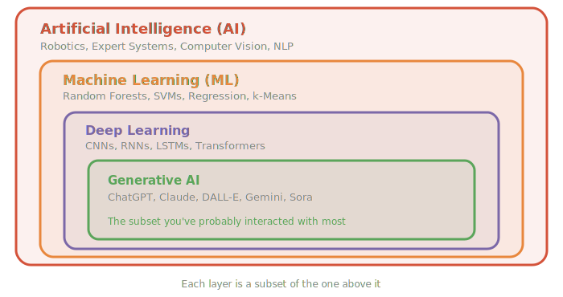
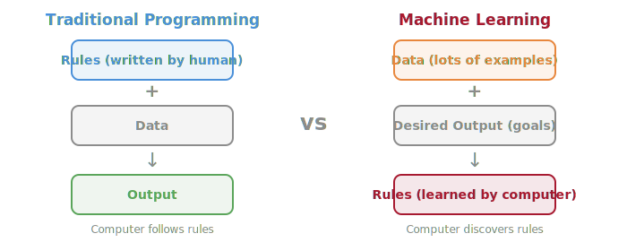
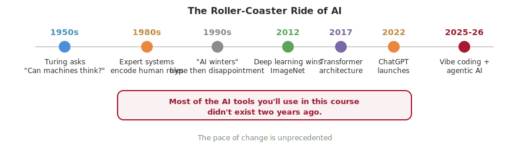
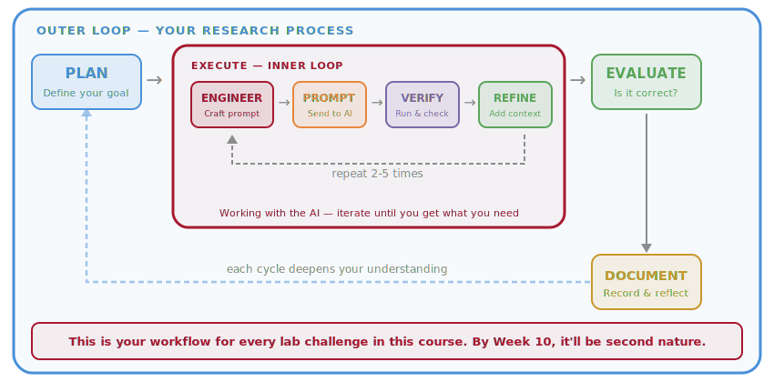
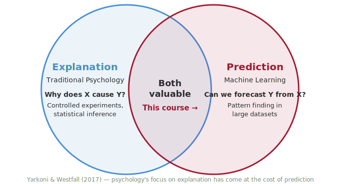

# Week 1: From Mind to Model — Why ML Belongs in Psychological Science

> Companion reading for the Week 1 lecture. Read this before or after the lecture — it covers the same ideas in more detail and at your own pace.

## Overview

This course is about learning to use modern computational tools — machine learning (ML) and artificial intelligence (AI) — to ask and answer questions about human behaviour. You'll learn what these tools are, when they're useful, and how to apply them to real psychological research questions.

Here's the reassuring part: **you don't need any coding or technical background.** You'll use AI assistants to help you write code, and you'll learn by doing — exploring data, building models, and making sense of results. The goal isn't to become a software developer. It's to become a researcher who can use these powerful new tools thoughtfully and critically.

## Key Concepts

### What Are AI and Machine Learning?

These terms get thrown around a lot, so let's define them clearly:

- **Artificial intelligence (AI)** is the broad field of building systems that can perform tasks that typically require human intelligence — things like recognising faces in photos, translating languages, or having a conversation.

- **Machine learning (ML)** is a subset of AI. Instead of a programmer writing explicit rules ("if the pixel is dark, it's probably an eye"), ML systems *learn patterns from data*. You show the system thousands of examples, and it figures out the rules on its own.

- **Deep learning** is a subset of ML that uses structures called neural networks — layers of mathematical operations inspired (loosely) by how neurons in the brain process information. Multiple layers ("deep") allow the model to learn increasingly abstract features — the first layer might detect edges, the next detects shapes, and the next detects entire objects. Deep learning is what powers most of the impressive AI you've seen in the news.

- **Generative AI (GenAI)** is the subset you've probably interacted with most — systems like ChatGPT, Claude, and Gemini that can generate new text, images, code, audio, or video based on what they've learned from vast amounts of training data.

Think of it like this: **AI** is the whole field, **ML** is the approach of learning from data, **deep learning** is a powerful technique within ML, and **GenAI** is a recent application of deep learning that can create new content.

There's a useful analogy from psychology here. Humans learn from examples too — a child doesn't memorise a rule book for recognising dogs; they see enough dogs and gradually learn the pattern. ML formalises this same idea mathematically.

But here's a striking difference: a child learns to recognise dogs from maybe 3–5 examples. A typical image classification model needs thousands or millions. Why are humans so much more data-efficient? We bring a lifetime of embodied experience, prior concepts, and structured knowledge to every new learning task. This efficiency gap is one of the deepest open questions in cognitive science and AI — and it tells us that whatever humans are doing when they learn, it's not the same thing current ML models are doing.

> **Think about it:** Why do you think a toddler can learn "dog" from a few examples while an ML model needs thousands? What does the human bring to the task that the model doesn't?

The key distinction from traditional programming: in conventional software, a programmer writes explicit rules that a computer follows. In machine learning, the programmer provides *data and a goal*, and the computer discovers the rules. This shift is what makes ML so powerful for research — it can find patterns in data that humans might never think to look for. But it also means we need to be careful: finding a pattern doesn't mean understanding it. That's where your training as a psychologist becomes essential.

### A Brief History

The story of AI goes back further than most people realise. Alan Turing posed the question "Can machines think?" in 1950. Early AI researchers in the 1950s and 60s were wildly optimistic — they thought human-level AI was just around the corner.

It wasn't. The field went through cycles of excitement and disappointment (researchers call these "AI winters"). Expert systems in the 1980s tried to encode human knowledge as rules, but they were brittle and couldn't handle the messiness of the real world.

The game changed in the 2000s and 2010s with the combination of massive datasets, cheap computing power, and better algorithms. Deep learning started winning competitions in image recognition, speech recognition, and game-playing. Then in 2017, a paper called "Attention Is All You Need" introduced the **transformer architecture** — the foundation of every modern large language model (LLM).

The public watershed moment came in late 2022 with ChatGPT, which showed millions of people what LLMs could do. Since then, the pace has been staggering: multimodal models that understand images and text together, AI coding assistants, deep research tools that can autonomously investigate topics, and agentic systems that can plan and execute multi-step tasks.

### The AI Tools Landscape in 2026

Let's map out the kinds of AI tools that are relevant to you as a researcher right now.

**Conversational AI and Deep Research.** [ChatGPT](https://chat.openai.com), [Claude](https://claude.ai), and [Gemini](https://gemini.google.com) are the most widely known. But they've evolved well beyond basic chat — they can reason through complex problems, write and debug code, analyse data, and process documents. Both ChatGPT and Gemini now offer **Deep Research** modes — when you activate Deep Research, the AI doesn't give you a quick answer. Instead, it autonomously searches, reads, and synthesises information across many sources, spending several minutes investigating your question thoroughly. It's like having a research assistant who can read dozens of papers and give you a structured summary. These tools are genuinely useful for literature reviews, understanding new methods, and exploring how a technique has been used across different fields.

**Foundation models and model sizes.** The AI tools above are powered by **foundation models** — large neural networks trained on massive amounts of data that can be adapted to many different tasks. As of early 2026, the leading foundation models include OpenAI's **GPT-5** family (released August 2025, with GPT-5.2 following in December), Google's **Gemini 3** (November 2025), and Anthropic's **Claude** family (including Claude Opus 4.6, the most capable, and faster/cheaper models like Claude Sonnet 4.5 and Claude Haiku 4.5). Each company offers models in different sizes — sometimes called "flavours" — that trade off between capability and speed. Larger models reason more carefully but take longer and cost more to run; smaller models are faster and cheaper but less capable. This is a practical tradeoff you'll encounter throughout the course.

The speed dimension here relates to **inference** — the process of using an already-trained model to generate a response to your input. When you type a question into ChatGPT and it produces an answer, that's inference. This is distinct from **training**, which is the much more expensive process of building the model in the first place — feeding it enormous amounts of data so it learns patterns, relationships, and knowledge. Training a frontier model can take months and cost hundreds of millions of dollars. Inference, by contrast, happens in seconds and costs fractions of a cent per query. We'll explore training and inference in much more detail when we cover neural networks in Weeks 9–10.

One recent architectural innovation worth mentioning is **mixture of experts (MoE)**. Rather than activating the entire neural network for every input, MoE models route each piece of input to specialised sub-networks (the "experts") that are most relevant. This means the model can be very large in total (with lots of stored knowledge) while remaining fast at inference (because only a fraction of the network activates for any given query). Several leading models, including GPT-5 and Gemini 3, use MoE designs. We'll look at how this works in more detail later in the course.

**Open-source models and running AI locally.** Not all AI has to live in the cloud. A growing ecosystem of **open-source models** — models whose architecture and trained weights are freely available — can be downloaded and run entirely on your own computer. Leading open-source models include Meta's **Llama 4** (available in Scout and Maverick variants, built on a mixture-of-experts architecture), Mistral AI's **Mistral Large 3** (a 675-billion-parameter model released under the Apache 2.0 open-source licence), and Google's **Gemma 3** (a smaller, efficient model designed for local use). These models range from compact versions that run on a laptop to larger versions that rival commercial offerings.

What makes local AI practical in 2026 is that consumer hardware has caught up. Apple's M4 Max and M4 Ultra chips offer up to 128–192GB of unified memory with high bandwidth — enough to run capable language models at interactive speeds. On the PC side, NVIDIA and AMD systems with high-VRAM GPUs (or multiple GPUs) can run even larger models. You don't need a data centre anymore; a well-configured MacBook Pro or desktop workstation can run a useful AI assistant entirely offline.

Why would you want to? **Data privacy and security.** When you use ChatGPT or Claude, your prompts are sent to external servers. For most coursework that's fine, but in research contexts — especially with sensitive clinical data, patient records, or proprietary datasets — sending data to external services may violate ethics approvals or data governance policies. Running a model locally means your data never leaves your machine. No API calls, no external logs, no "your data may be used to improve our models." Tools like [Ollama](https://ollama.com) (open-source, command-line) and [LM Studio](https://lmstudio.ai) (graphical interface, beginner-friendly) make it straightforward to download and run these models on your own hardware. This is an increasingly important option for researchers working with sensitive data — and one we'll touch on later in the course.

**Multimodal AI.** Modern AI models aren't limited to text — they can see, hear, and generate across multiple types of media simultaneously. GPT-5 can process text, images, and audio in the same conversation. Gemini 3 is natively multimodal. Claude can analyse images and documents. You can upload a research paper and ask for a summary, show the AI a graph and ask it to explain the pattern, or speak to it and hear it respond with natural-sounding speech. For research, this means AI can help you transcribe interviews, analyse visual data, process questionnaire responses, and more — all in one conversation.

**Coding assistance and vibe coding.** [GitHub Copilot](https://github.com/features/copilot) works inside your code editor (VS Code), suggesting code as you type and answering questions via Copilot Chat. More recently, entire code editors have been built around AI assistance — [Cursor](https://cursor.com) and [Windsurf](https://windsurf.com) are VS Code-based editors that deeply integrate AI into every part of the coding workflow, letting you edit, refactor, and debug across entire projects through conversation.

The bigger shift is what Andrej Karpathy (a founding member of OpenAI) coined in February 2025 as **"vibe coding"** — describing what you want in plain English and letting the AI write the code for you. It's worth noting how mainstream this has become: 25% of startups in the Y Combinator Winter 2025 batch reported that 95% of their codebase was AI-generated.

While we appreciate the spirit of vibe coding, what we'll do in this course is something more deliberate. Pure vibe coding is passive — you describe what you want, copy-paste whatever the AI gives you, and hope it works. That's fine for quick prototypes, but it doesn't build understanding. Instead, we want you to treat AI coding assistants as **active collaborators**. That means reading the code they generate, understanding what it does, asking questions when something doesn't make sense, and developing the judgement to know when the output is good and when it's not. You're not just accepting whatever the AI produces — you're working *with* it, steering the process, and learning along the way. We'll formalise this into a structured workflow called the **LLM Problem-Solving Loop** later in this reading.

At the frontier of coding assistance are **CLI (command-line interface) agents** — AI tools that work directly in your terminal, reading your entire codebase, writing and editing files, running tests, and fixing bugs autonomously. [Claude Code](https://docs.anthropic.com/en/docs/claude-code), Anthropic's agentic coding tool, is currently (as of February 2026) the most capable of these, able to work across entire projects with minimal guidance. OpenAI offers [Codex CLI](https://github.com/openai/codex) and Google has [Gemini CLI](https://github.com/google-gemini/gemini-cli) (open source and free to use). Claude Code is the most powerful option in my experience, though it's also the most expensive — a case of getting what you pay for. These tools represent the cutting edge of AI-assisted development, where the AI doesn't suggest code so much as act as an autonomous collaborator.

**Image, video, and audio generation.** AI can now generate remarkably capable images from text descriptions (DALL-E 3, [Midjourney](https://midjourney.com), Stable Diffusion, Adobe Firefly), create video from text prompts (Sora, Runway, Pika, Google Veo), synthesise natural-sounding speech from text ([ElevenLabs](https://elevenlabs.io), OpenAI TTS), and transcribe speech to text with high accuracy (Whisper). For research, these tools open up possibilities for creating experimental stimuli, generating visualisations, transcribing interviews, and making materials accessible. [NotebookLM](https://notebooklm.google.com) can even generate podcast-style audio overviews of papers you upload — two AI voices discussing the content in an engaging way.

**Research tools.** A new category of AI tools is designed specifically for academic research. [NotebookLM](https://notebooklm.google.com) lets you upload papers, lecture notes, or textbook chapters and generates summaries, interactive mind maps, and audio overviews. [Elicit](https://elicit.com) synthesises evidence from over 200 million academic papers. [Consensus](https://consensus.app) lets you ask research questions in plain language and get answers backed by peer-reviewed literature. [Semantic Scholar](https://semanticscholar.org) uses AI to help you discover relevant papers and understand citation networks.

**Agentic systems.** The frontier of AI in 2026 is *agentic* systems — AI that doesn't just answer questions but can plan, act, and iterate to complete complex tasks autonomously. An agent is more than a chatbot: it has access to **tools** (like web search, code execution, file management, and databases), it can use **skills** (specialised capabilities like data analysis, writing, or research), and it can break a complex task into steps, execute each one, check its own work, and adjust its approach when something goes wrong.

For example, a coding agent like Claude Code can read your entire project, understand the structure, write new code across multiple files, run the tests, fix any failures, and commit the changes — all from a single instruction. A research agent can search academic databases, read papers, synthesise findings, identify gaps, and produce a structured literature review. These aren't hypothetical — they exist and are being used today.

The field is also moving toward **multi-agent systems**, where multiple specialised AI agents collaborate on a task — one agent might handle research while another writes code and a third reviews for errors. New protocols like Anthropic's **Model Context Protocol (MCP)** and Google's **Agent-to-Agent (A2A)** protocol are being developed to let agents communicate with each other and with external tools in standardised ways — much like how HTTP standardised communication on the web.

How big is this shift? Industry analyst Gartner forecasts that by the end of 2026, 40% of enterprise applications will incorporate AI agents. A recent McKinsey survey found a 1,445% surge in inquiries about multi-agent systems. Whether or not those numbers turn out to be precise, the direction is clear: AI is moving from a tool you query to a collaborator you work alongside. We'll explore agentic AI in depth in Week 11.

All of these are **tools that augment your capabilities, not replace your thinking.** A hammer doesn't build a house by itself — a skilled carpenter with a hammer builds better houses faster. That's the relationship we want you to develop with AI tools.

### What Is an LLM and How Does It Work?

Under the hood, most of the modern AI tools mentioned above — ChatGPT, Claude, Gemini, Copilot — run on **large language models** (LLMs). It's worth taking a moment to understand what an LLM actually is and how it works, because understanding them makes you better at using them. We'll revisit this in much more detail in Weeks 9–11, but here's what you need to know for now.

An LLM is a neural network — a computational system loosely inspired by the brain — that has been trained on enormous amounts of text: books, articles, websites, code, conversations. During training, the model learns statistical patterns in language: which words tend to follow which other words, how sentences are structured, what kinds of answers follow what kinds of questions. The result is a system that can generate remarkably fluent and useful text, even though it has no understanding of what the words *mean*.

The basic unit of text for an LLM is a **token** — roughly a word or a piece of a word. The word "psychology" might be one token; "unbelievable" might be split into "un," "believ," and "able." When you type a prompt, the model converts your text into tokens, processes them through its neural network, and generates a response one token at a time — each time predicting the most likely next token given everything that came before. That's it. At its core, an LLM is a next-token prediction machine. The astonishing thing is how much useful behaviour emerges from this deceptively simple process when done at scale.

There's one more concept worth introducing now: **embeddings**. Before an LLM can work with a token, it converts it into a long list of numbers — a numerical representation called an embedding. These embeddings capture *relationships* between words: words with similar meanings end up with similar numbers. "Happy" and "joyful" have embeddings that are close together; "happy" and "refrigerator" do not. This is how the model represents meaning — not through definitions, but through patterns of similarity learned from billions of examples. Embeddings turn out to be extraordinarily powerful, and we'll explore them in depth when we get to text analysis and semantic similarity in Week 11.

Why does any of this matter for you right now? Because it shapes how you should interact with these tools. An LLM doesn't "know" things the way you do — it has learned statistical patterns from text. It can be confident and wrong. It can produce plausible-sounding nonsense. It doesn't remember previous conversations (unless you're in the same chat session). And it responds to exactly what you give it — the clearer and more specific your prompt, the better the output. That's why the next section matters so much.

### Prompt Engineering and Context Engineering

This section might be the most practically useful thing you read all semester. Your ability to get good results from AI tools depends almost entirely on how you communicate with them.

**Prompt engineering** is the art of writing clear, effective instructions for an AI. A vague prompt gets a vague answer. A specific, well-structured prompt gets useful output. This isn't a "nice to have" — it's the difference between spending 2 minutes and 20 minutes on a task. Compare these examples:

**Example 1 — Data visualisation:**
- *Vague:* "Make me a graph"
- *Specific:* "Create a scatter plot of Depression score vs Sleep hours from my DataFrame called `data`, with points coloured by Gender, using matplotlib. Add a title, axis labels, and a legend."

**Example 2 — Debugging:**
- *Vague:* "My code doesn't work, fix it"
- *Specific:* "I'm getting a KeyError: 'depression_score' when I run `data['depression_score'].mean()`. Here are my column names: Age, Gender, Depression, Sleep_hrs. I think the column might be called something different. How do I fix this?"

**Example 3 — Understanding a method:**
- *Vague:* "Explain random forests"
- *Specific:* "I'm a psychology honours student learning ML for the first time. Explain random forests using a psychology example (like predicting treatment outcomes). Compare it to regular regression, which I'm familiar with. Keep it under 300 words."

In each case, the specific prompt tells the AI what you're working with, what you want, and what constraints to follow. The specific prompts will almost certainly give you useful output on the first try. The vague prompts? You'll be going back and forth for a while.

**Context engineering** takes this further. The AI doesn't know your data, your research question, or your constraints unless you tell it. The more relevant context you provide — what libraries you're using, what your data looks like, what you've already tried, what didn't work — the better the output. Think of it like briefing a new research assistant: the more background you give them, the more useful their work will be.

**What makes a good prompt:**
- **Be specific** about what you want, including format, variables, and level of detail
- **Give context** — describe your data, your tools, your background, and your goal
- **Ask for explanations** — add "and explain each line of code" to learn as you go
- **State constraints** — "Use only pandas and matplotlib" prevents the AI from suggesting unfamiliar tools
- **Provide examples** — show what the input looks like and what you want the output to look like
- **Iterate** — if the first result isn't right, refine your prompt with more detail and try again

The need for all this careful prompting is itself revealing. If you told a human colleague "make me a graph of the sleep data," they'd ask a clarifying question or make a reasonable guess — drawing on shared context, theory of mind, and common sense. An AI can't do that. It doesn't know what you've been working on, what matters to you, or what "good" looks like in your field. It needs you to provide all of that explicitly.

> **Think about it:** What does the need for prompt engineering tell us about the difference between human understanding and what AI systems do? What would an AI need to be able to do to *not* need detailed prompts?

### The LLM Problem-Solving Loop

This is the core workflow you'll use all semester. It has two nested loops — an outer loop for your research process, and an inner loop for working with the AI.

**Outer loop (your research process):**

1. **PLAN** — Define what you want to achieve. What question are you answering? What output do you need?
2. **EXECUTE** — Use the inner loop (below) to get AI-generated code and analysis
3. **EVALUATE** — Does the result answer your question? Is it correct? Does it make sense given what you know about the domain?
4. **DOCUMENT** — Record what you did, what worked, and what you learned

**Inner loop (working with the AI):**

1. **ENGINEER** — Craft your prompt: be specific, provide context, state your goal clearly. Context might mean describing your data, but it can also mean uploading a document, pasting in an error message, or even asking the AI to do a web search to find relevant documentation first.
2. **PROMPT** — Send it to the AI
3. **VERIFY** — Read the code the AI gives you. Don't just copy and paste it — look at what it's doing. Then run it. Does it execute without errors? Does the output make sense? Check it against what you know about your data and your research question.
4. **REFINE** — If it's not right: What went wrong? Add more context, correct misunderstandings, try a different approach. Then go back to step 1.

The inner loop often runs 2–5 times before you get what you need. That's normal and expected — even experienced developers iterate with AI tools. But "iterate" doesn't mean blindly re-prompting and hoping for the best. Here are some strategies that work well:

- **Ask the AI to plan first.** Before it writes any code, ask it to outline its approach — what steps it will take, what libraries it will use, what the output will look like. Review the plan. If the approach doesn't make sense, redirect before any code is written. This saves a lot of time.
- **Break the problem into smaller pieces.** Rather than asking for a complete analysis in one go, work through it step by step — load the data first, then explore it, then build one visualisation at a time. Smaller, focused prompts produce better results than large, ambitious ones.
- **Provide rich context.** The more the AI knows about your situation, the better it performs. This might mean pasting in your column names, uploading a data dictionary, sharing an error traceback, or pointing it to documentation. Some tools let you attach files or ask the AI to search the web — use those capabilities.
- **Explain what went wrong, not just that it went wrong.** "This didn't work" is a weak refinement. "The plot shows all points in one colour, but I wanted them coloured by the Gender column, which has values 'Male' and 'Female'" gives the AI exactly what it needs to fix the issue.

The AI might misunderstand your data structure, use the wrong function, or produce output that's technically correct but not what you wanted. Each round of refinement teaches you something about how the AI interprets your requests — and that understanding makes you faster and more effective over time.

**The key insight:** You are always in control. You decide what to build, you verify the output, you judge whether it's correct. The AI is a powerful tool, but it doesn't understand your research question the way you do. It doesn't know what matters in your field, what's ethically appropriate, or what a reviewer would question. Your domain expertise combined with AI capability is what makes for powerful research.

### ML and AI in Psychological Science

So why should psychologists care about machine learning? Here's the short answer: because it lets us do things we couldn't do before.

Psychology has traditionally focused on **explanation** — understanding *why* things happen through controlled experiments and statistical inference. Machine learning adds a complementary focus on **prediction** — building models that can accurately forecast outcomes from data. As Yarkoni and Westfall (2017) argued in an influential paper, psychology's almost exclusive focus on explanation has come at the cost of prediction, and the two approaches actually strengthen each other.

But there's a tension worth sitting with. ML can predict depression from smartphone data without knowing anything about mood, motivation, or lived experience. It finds statistical patterns that work — reduced movement predicts depressive episodes — but it has no understanding of *why*. Humans, by contrast, can predict a friend's mood from a single text message because they understand the person. One approach scales to millions of people; the other has depth and understanding.

> **Think about it:** An ML model can predict depression risk from phone data, but it doesn't "understand" depression. A clinician might be less accurate but understands the patient. When is prediction without understanding enough? When is it not?

Here are four recent examples of how AI and ML are being used in psychological and cognitive science research:

**1. Mental health — Digital phenotyping.** Researchers are using smartphone sensor data — GPS movement patterns, screen time, sleep duration, typing speed — combined with ML models to predict mental health episodes before they happen. Multiple studies in 2024–2025 have demonstrated that passive smartphone data can identify depression risk with meaningful accuracy, opening the door to early intervention systems that don't rely on people self-reporting their symptoms.

> **Think about it:** If an ML model can predict that you're about to have a depressive episode based on your phone usage — before you've told anyone, maybe before you've even noticed yourself — is that helpful or unsettling? Who should have access to that prediction? Your doctor? Your employer? Your insurer? And consider the flip side: many people with depression don't seek help because of stigma or lack of awareness. A system that gently nudges someone toward support at the right moment could save lives. How do we balance the enormous potential of digital phenotyping with the equally enormous privacy and ethical concerns? (For more on the promises and challenges of digital phenotyping, see [Onnela & Rauch, 2016](https://doi.org/10.1038/npp.2016.7).)

**2a. Cognitive science — LLMs as cognitive models.** [Hagendorff, Fabi, and Kosinski (2023)](https://doi.org/10.1038/s43588-023-00527-x) tested large language models on classic cognitive psychology tasks — the kinds of semantic illusions and reasoning biases from Kahneman's "Thinking, Fast and Slow" that you may have studied. They found that as models grew larger, they developed human-like intuitive thinking and cognitive biases. But these biases disappeared in ChatGPT, which could engage in more deliberate "System 2" reasoning. This raises fascinating questions about what these models are actually learning. Published in *Nature Computational Science*.

But here's what makes this so interesting for cognitive scientists: the LLMs are exhibiting the *same behavioural patterns* as humans, but through entirely different mechanisms. Human biases are shaped by evolution, emotion, and embodied experience. LLM biases emerge from statistical regularities in text. When two very different systems produce similar outputs, can we conclude they're using similar processes? This is a version of one of the oldest questions in cognitive science.

> **Think about it:** If an LLM shows the same reasoning bias as a human on a classic cognitive psychology task, does that mean it's "thinking" the same way? What evidence would you need to make that claim?

**2b. A foundation model of human cognition.** [Binz, Schulz et al. (2025)](https://doi.org/10.1038/s41586-025-09215-4) took this idea much further. They created **Psych-101**, an unprecedented dataset containing trial-by-trial data from over 60,000 participants making more than 10 million choices across 160 psychology experiments — covering decision-making, memory, learning, reasoning, and more. They then fine-tuned a large language model on this data to create **Centaur**, a computational model that predicts human behaviour better than traditional cognitive models across all of these domains. Remarkably, Centaur generalises to entirely new tasks and experimental designs it was never trained on. Even more striking: after fine-tuning, the model's internal representations became more aligned with actual human neural activity, as measured by brain imaging data. This is a powerful demonstration of ML not as a black-box predictor but as a tool for building unified theories of cognition — a single model that captures how humans decide, remember, learn, and reason. Published in *Nature*. [Open access preprint](https://arxiv.org/abs/2410.20268).

> **Think about it:** When we talk about LLMs, we often say they "reason," "learn," and "decide." But is that really what they're doing? At its core, a large language model is designed to do one thing: predict the next token (word or word-fragment) in a sequence. It has no goals, no experiences, no understanding of what the words mean. These models are trained on human text — billions of words written by people — and from those statistical regularities they produce outputs that look remarkably like reasoning. Are we projecting human qualities onto a sophisticated pattern-matcher? Or does "predicting the next token" become something more when done at sufficient scale and with the right training data? [Bender et al. (2021)](https://doi.org/10.1145/3442188.3445922) famously called LLMs "stochastic parrots" — systems that stitch together sequences of words based on statistical patterns without any reference to meaning. But if a "parrot" can predict human cognition better than models built by cognitive scientists, what does that tell us? What would it even mean for a model to *truly* reason, as opposed to producing outputs that look like reasoning?

**3. AI personas as synthetic participants.** [Argyle et al. (2023)](https://doi.org/10.1017/pan.2023.2) showed that LLMs can be conditioned with demographic backstories to simulate human survey responses with surprising accuracy — what they call "algorithmic fidelity." They created "silicon samples" that reproduced real survey distributions across sociodemographic groups. This opens up possibilities for rapid pilot testing of experiments and studying hard-to-reach populations, while raising important ethical questions about synthetic data in research. Published in *Political Analysis*. [Open access preprint](https://arxiv.org/abs/2209.06899).

> **Think about it:** Where does the "intelligence" in these AI systems actually come from? The philosopher Daniel Dennett spent decades asking versions of this question — who or what is the ghost in the machine? In [*The Intentional Stance*](https://mitpress.mit.edu/9780262540537/the-intentional-stance/) (1987), Dennett argued that we attribute beliefs, desires, and intelligence to systems when doing so helps us predict their behaviour — regardless of what's actually happening inside. We do this with people, animals, and now AI. But consider: the text that LLMs are trained on was written by humans. The statistical regularities the model learns are regularities in *human* language, reflecting *human* knowledge, values, and ways of thinking. Even in supervised ML more broadly, the labelled training data — "this image is a dog," "this patient has depression" — depends on human judgement. In a real sense, AI systems are borrowing intelligence from us. They're distilling the collective output of human thought into statistical patterns. Does that make them intelligent? Or are they more like very sophisticated mirrors, reflecting our own intelligence back at us?

**4. ML for understanding human decision-making.** [Auletta, Kallen, di Bernardo, and Richardson (2023)](https://doi.org/10.1038/s41598-023-31807-1) used LSTM neural networks and explainable AI (SHAP) to predict and understand human action decisions during a collaborative herding task. The ML models could predict expert and novice decisions at timescales preceding conscious intent, and the explainable AI analysis revealed that experts were more attuned to their co-actor's behaviour — something traditional analysis methods would have missed. Published in *[Scientific Reports](https://doi.org/10.1038/s41598-023-31807-1)* (open access).

> **Think about it:** What does it mean that an ML model can predict a human's action decision *before the human consciously makes it* — for example, predicting which way a player will move in a sports game hundreds of milliseconds before they act? At first glance, this seems to undermine free will. But consider another interpretation: human behaviour, even when it feels spontaneous and unpredictable, may be far more structured and deterministic than we realise. Complex systems — from weather to flocking birds to human coordination — can appear noisy and irregular on the surface while being governed by deterministic dynamics underneath. This idea has deep roots across the behavioural sciences. [Kelso (1995)](https://mitpress.mit.edu/9780262611312/dynamic-patterns/) showed that brain and behaviour exhibit features of pattern-forming dynamical systems — multistability, phase transitions, and self-organisation. [Thelen and Smith (1994)](https://doi.org/10.7551/mitpress/2524.001.0001) demonstrated that even infant development — reaching, walking, learning — follows complex dynamical principles rather than pre-programmed stages. [Van Orden, Holden, and Turvey (2003)](https://doi.org/10.1037/0096-3445.132.3.331) found fractal patterns in cognitive performance — reaction times, reading, categorisation — suggesting that cognition itself is a self-organising process. And [Warren (2006)](https://doi.org/10.1037/0033-295X.113.2.358) showed that perception and action are coupled dynamical systems, with behaviour emerging from the continuous interaction between body, brain, and environment. The apparent randomness in all these domains isn't randomness at all — it's complexity. If ML can learn to read those patterns, what does that tell us about the nature of human behaviour itself?

These examples should make one thing clear: ML and AI are already reshaping how we study the mind, behaviour, and the brain. But as the think-about-it prompts above suggest, these tools raise as many questions as they answer — about what it means to "reason," where intelligence actually comes from, the ethics of prediction, and the nature of human behaviour itself. None of these tools understand psychology. They find patterns. It's up to you — the researcher — to decide which patterns matter, which are meaningful, and which are artefacts of the data or the model.

That's why this is a **tools, not magic** course. Good research questions, careful experimental design, and critical thinking are more important than ever. ML can find patterns in noisy data — including patterns that aren't real. Models can inherit and amplify biases from their training data. And as we saw, even the most impressive AI outputs are built on borrowed human intelligence, statistical regularities, and next-token prediction — not understanding. Throughout this course, we'll spend as much time learning to evaluate and question ML results as we will building models.

## Common Misconceptions

- **"AI will replace researchers."** No. AI augments what researchers can do — it handles computation and pattern-finding so you can focus on asking good questions, designing studies, and interpreting results.

- **"ML is just statistics."** There's overlap, but they have different emphases. Statistics traditionally focuses on inference and quantifying uncertainty ("is this effect real?"). ML focuses on prediction and scalability ("can I accurately predict outcomes in new data?"). Both are valuable, and this course bridges the two.

- **"You need to be a programmer."** Not anymore. With LLM coding assistants and vibe coding, you can describe what you want in plain English and get working code. You still need to understand what the code is doing, but you don't need to write it from scratch.

- **"AI is objective."** Models inherit biases from their training data and the choices made by their designers. An AI trained on biased data will produce biased results. Critical evaluation of AI outputs is essential — a theme we'll return to throughout the course.

## Getting Ready for Week 2

Before the next class, please complete the setup guide: **[Getting Started](../../setup/getting-started.md)**

The key steps:
1. Create a GitHub account with a **personal email** (not your MQ email — so the account persists after graduation)
2. Apply for the GitHub Student Developer Pack (gives you free Copilot Pro)
3. Install VS Code and Python
4. Run the setup script to install all course packages
5. Sign up for at least one AI assistant ([ChatGPT](https://chat.openai.com), [Claude](https://claude.ai), or [Gemini](https://gemini.google.com))

Complete as much as you can before Week 2. We'll dedicate the first part of class to troubleshooting any issues, then jump straight into the challenge.

## What's Ahead in This Course

Over the next 12 weeks, you'll learn to:
- **Predict** outcomes using regression and classification models
- **Discover structure** in data using clustering and dimensionality reduction
- **Build and evaluate** neural networks
- **Work with text** using embeddings and large language models
- **Think critically** about what ML can and can't tell us

The LLM Problem-Solving Loop is your core workflow all semester. You'll use it in every lab, refining your ability to communicate with AI tools and verify their output. By the end, you'll be able to take a research question, choose an appropriate ML approach, implement it with AI assistance, and critically evaluate the results.

Let's get started.

## Readings

See [readings.md](readings.md) for suggested papers, recommended books, and research tools.

---

*[Back to course overview](../../README.md)*
