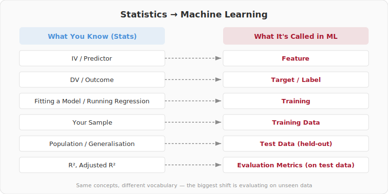
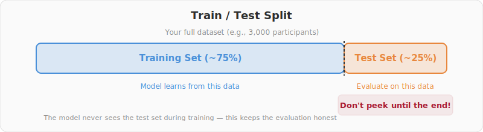
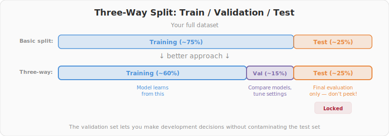
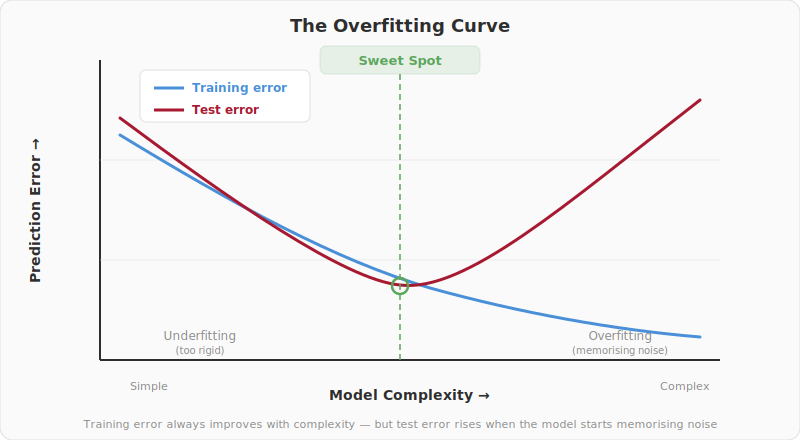
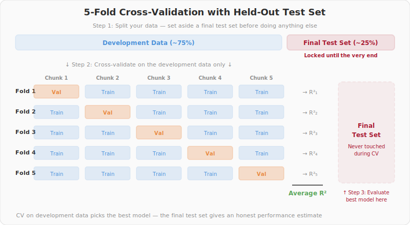

# Week 3: Models, Not Magic — Generalisation, Overfitting, and How ML Misleads

> Companion reading for the Week 3 lecture. Read this before or after the lecture — it covers the same ideas in more detail and at your own pace.

## Overview

This week is about the foundational concepts that make machine learning work — and the ways it can fool you if you're not careful. We'll translate the statistics you already know into ML language, then build on that foundation with the ideas that separate good ML from bad: how to split your data, what overfitting is, and how to know whether your model actually works.

The lecture slides for this week are available here: **<a href="https://xkiwilabs.github.io/Practical-AI-for-Behavioural-Science/weeks/week-03-lecture/slides/index.html" target="_blank">Week 3 Slides</a>**

## Key Concepts

### Speaking ML: A Translation Guide

This is the most important section of this week's reading. As a psychology or cognitive science student, you already know more statistics than you might think — you probably learnt enough of the fundamentals to follow this course back in high school or early undergrad, and you've built on that since. You've encountered ideas like variables, correlations, samples, and maybe even regression. Machine learning uses different words for many of the same ideas. Once you see the mapping, ML becomes far less intimidating.

| What you know from stats | What it's called in ML | Same thing? |
|---|---|---|
| Independent variable (IV) / predictor | **Feature** | Yes — the inputs to your model |
| Dependent variable (DV) / outcome | **Target** (regression) or **Label** (classification) | Yes — what you're predicting |
| Categorical DV (e.g., diagnosis groups) | **Class** | Yes — the categories in classification |
| Running a regression / fitting a model | **Training** | Similar — but the goal shifts from inference to prediction |
| Your sample | **Training data** | Partly — in ML, your sample gets split (see below) |
| The population you generalise to | **Test data** (a held-out slice of your sample) | Conceptually similar — data the model hasn't seen |
| Predictor coefficients / regression weights | **Model parameters** (or **weights**) | Yes — the numbers the model learns |
| Choosing which predictors to include | **Feature selection** | Yes — which inputs to give the model |
| R², adjusted R² | **Evaluation metrics** (R², MAE, RMSE) | Similar — but calculated on unseen data, not the same data used to fit |

If you've ever fitted a line of best fit, run a correlation, or done a regression in SPSS or JASP, you've already done a version of machine learning — you just called it statistics.

The biggest conceptual shift is this: in traditional statistics, you fit a model to your *entire* sample and then assess whether the effects are statistically significant. In ML, you fit a model to *part* of your data and test whether it can predict the *rest*. Same data, fundamentally different question. Statistics asks "is this effect real?" ML asks "can I predict what happens next?"

Two broad categories of ML are worth knowing now:

- **Supervised learning** — you have a target variable (labelled data). Regression predicts a continuous target; classification predicts a categorical one. Weeks 3–6 of this course cover supervised learning.
- **Unsupervised learning** — no target variable. Instead, you're looking for structure in the data itself — clusters, dimensions, hidden groupings. Weeks 7–8 cover this.

**Running example:** In Week 2, you explored a synthetic DASS dataset — 3,000 fake participants with lifestyle variables and depression scores. If we want to predict DASS_Depression (the **target**) from Sleep_hrs_night, Exercise_hrs_week, and SocialMedia_hrs_week (the **features**), that's supervised learning — specifically regression, because depression scores are continuous (0–42).



### What Is a Model, Really?

The word "model" can sound intimidating, but you use models all the time. "Sleep affects mood" is a model — a simplified version of reality that captures a pattern. A regression equation is a model. A decision tree is a model. Even "students are more stressed than working adults" is an informal model.

In statistics, a model describes relationships in your sample. In ML, a model makes predictions about **new** data — people or observations it has never seen before.

Before a model can learn from data, the data usually needs some preparation. This is called **preprocessing** — things like handling missing values (you saw some in Week 2), converting categories to numbers (e.g., turning Gender into numerical codes), and scaling variables so they're on comparable ranges. We'll define these techniques properly in Week 4 when you put them into practice.

Here's the connection to what you've already done: in Week 2, you explored the synthetic DASS dataset visually. You found that sleep and exercise were negatively correlated with depression. A model formalises those patterns — instead of just seeing the trend line, it learns the relationship so it can make predictions for new participants.

### The Fundamental Problem: Generalisation

The core goal of machine learning is **generalisation** — making accurate predictions about data the model has never seen.

Here's an analogy. Imagine studying for an exam by memorising every past exam paper word-for-word. You'd get perfect marks on those specific papers. But if the exam has new questions — even on the same topics — you'd be in trouble. Understanding the underlying concepts (generalising) beats memorising the specifics every time.

In research terms: a model that explains your sample perfectly but fails on new participants is worthless. We want models that capture *real patterns* — not noise that's specific to our particular sample.

You already know about generalisation from inferential statistics — that's what it means to generalise from a sample to a population. ML takes this further: instead of asking "is this effect real?" it asks "can I predict what will happen for a new person?" This connects directly to Week 1's theme of prediction versus explanation.

### Train/Test Splits

The simplest defence against self-deception is to split your data into two parts before building any model:

- **Training set** (~70–80% of your data): the model learns from this. It's like fitting your regression to part of your sample.
- **Test set** (~20–30%): held out and untouched until the very end. It's like collecting a completely new sample to check whether your findings replicate — except you don't need to run a new study.

The cardinal rule: **never look at or use the test set during model development.** If you peek — even once — it stops being "new" data, and your evaluation is contaminated.

Here's the stats analogy: imagine you could split your sample in half, run your analysis on one half, and then check whether the same pattern holds in the other half — all before publishing. That's what train/test splitting does, and it's a remarkably powerful safeguard.



In practice, many projects use a **three-way split**: training, **validation**, and test. The validation set is a portion carved out of the training data that you use during development — for example, to compare different models or tune settings (like how strong a regularisation penalty to apply). The test set stays locked away until the very end. Cross-validation (covered below) is one way to get the benefits of a validation set without sacrificing too much data.



There are also more specialised splitting strategies designed for the kinds of data psychologists often work with. **Leave-One-Participant-Out (LOPO)** holds out one participant at a time and trains on everyone else — essential when you have repeated measures from the same person, because a random split might leak information from one person's data into both training and test. **Leave-One-Group-Out (LOGO)** does the same at the group or site level — useful for multi-site clinical studies where you want to know if a model trained at one hospital generalises to another. **Stratified splitting** ensures that important categories (like diagnosis groups or gender) are represented proportionally in both training and test sets. We'll explore these methods in detail in later weeks when we work with more complex datasets.

> **Think about it:** A researcher builds 20 different models and picks the one that scores best on the test set. They report that model's test performance as their result. Why is this a problem? How is it similar to p-hacking in traditional statistics?

### Overfitting and Underfitting

**Overfitting** is when a model memorises the training data — including its noise and quirks. It performs brilliantly on training data but poorly on anything new. Like the student who memorised past exam answers without understanding the material.

**Underfitting** is the opposite: the model is too rigid to capture real patterns. A straight line through clearly curved data. Like the student who only read the chapter summaries.

The goal is the **sweet spot** — complex enough to capture genuine patterns, constrained enough to ignore noise.

Here's a concrete example from the synthetic DASS dataset. If we include *every single column* as a feature — all 44 variables, including the individual DASS items (DASS_1, DASS_2, ... DASS_21) — the model might "learn" that summing those items predicts DASS_Depression perfectly. But that's circular — it hasn't learned anything useful about how lifestyle relates to depression. It's just rediscovered the scoring formula.

Overfitting isn't just a statistical nuisance — it can be dangerous. In clinical psychology, imagine a model that appears to predict suicide risk with 95% accuracy in the training sample but drops to 55% on new patients. A clinician relying on that model would have false confidence in predictions that are barely better than a coin flip.



> **Think about it:** Psychology traditionally uses relatively rigid models — t-tests, ANOVA, linear regression — that make strong assumptions. ML offers far more flexible models. When might a psychologist *prefer* a biased but stable model over a flexible but unstable one? Think about clinical decision-making, replication, and sample sizes.

### The Bias–Variance Trade-off

The tension between overfitting and underfitting has a name: the **bias–variance trade-off**.

- **Bias** is how far off the model's predictions are on average. High bias means the model consistently misses the truth — it's underfitting. A straight line fitted to a curved relationship has high bias.
- **Variance** is how much the model's predictions change when you train it on different samples. High variance means the model is unstable — it's overfitting. A very wiggly curve that changes dramatically with each new dataset has high variance.

The trade-off: reducing bias tends to increase variance, and vice versa. You can't minimise both at once — you're choosing where on the spectrum to sit.

Here's where this connects to what you know: the statistical models you've used (t-tests, ANOVA, linear regression) are **high-bias, low-variance** models. They make strong assumptions (like linearity), which means they can miss real patterns — but they give stable, reproducible results even with small samples. ML models like neural networks are **low-bias, high-variance** — they make fewer assumptions and can capture complex, non-linear patterns, but they need more data and are less stable.

This has a direct connection to the replication crisis. Complex analyses on small samples — high variance — produce findings that don't replicate. ML makes this trade-off explicit rather than hiding it behind a single p-value.

### Cross-Validation

A single train/test split has a weakness: what if you got a lucky (or unlucky) split? Your performance estimate depends on which particular observations ended up in training versus test.

**K-fold cross-validation** fixes this. Split your data into K equally sized chunks (typically 5 or 10). Train on K-1 chunks, test on the remaining chunk. Repeat K times, rotating which chunk is held out each time. Average the K performance scores.

Think of it like running your study K times with different random samples. Instead of one estimate of performance, you get K estimates — and you can examine how much they vary. If performance is consistent across folds, you can be more confident the model generalises. If it swings wildly, something may be wrong.



An important point: cross-validation is for model **development** — comparing different approaches, tuning settings, selecting features. You should still keep a final held-out test set that you only touch at the very end for your final performance report.

### A Note on Random Seeds

When you split data into training and test sets, the split is **random** — different observations land in each set every time you run the code. This means your results can change just because of which rows ended up where. A **random seed** is a number you set before the split that makes the randomness reproducible: same seed, same split, same results every time.

During development, fix your seed so your results are stable while you're building and comparing models. But before you report final results, it's good practice to try a few different seeds and check that your conclusions don't depend on one lucky split. If your model performs well with seed 42 but poorly with seed 123, that's a warning sign — the results may not be robust.

This idea extends beyond data splitting. Later in the course, when we work with models like neural networks, you'll see that the model's starting point is also random (its initial **weights** are set randomly before training begins). Fixing those seeds makes your entire analysis reproducible from start to finish. We'll revisit this in detail when we get to those methods — for now, just know that `random_state=42` (or any number) in your code is doing something important.

### Baseline Models: The "Am I Actually Learning Anything?" Check

Before building anything complex, always ask: what would happen if I made the dumbest possible prediction?

For regression, the simplest baseline is to predict the **mean** of the target variable for every observation. In our synthetic DASS dataset, the mean DASS_Depression score is about 14. If we predict 14 for every single person, our Mean Absolute Error (MAE) is roughly 9 points. That's our baseline — if a fancy model can't beat predicting 14 for everyone, it hasn't learned anything useful.

Baselines keep you honest. A model with R² = 0.15 sounds bad — until you realise the baseline is R² = 0.00 and the theoretical maximum given the noise in your data might be R² = 0.30. Context matters.

> **Think about it:** A research team reports that their ML model predicts therapy outcomes with 72% accuracy. Sounds impressive — but what if 70% of patients improve regardless of treatment? Their model barely beats random guessing. Why do you think baseline comparisons are so rarely reported in published ML papers in psychology?

### Evaluation Metrics for Regression

You need a way to measure how good (or bad) your predictions are. Here are the three most common metrics for regression:

- **R² (coefficient of determination):** The proportion of variance in the target explained by the model. R² = 0.30 means the model explains 30% of the variation in depression scores. You know this from traditional stats — but in ML, we calculate it on the **test set**, not the training set.

- **MAE (Mean Absolute Error):** On average, how many points off is each prediction? It's intuitive and in the same units as your target. An MAE of 4.2 on the DASS Depression scale (0–42) means predictions are off by about 4 points on average.

- **RMSE (Root Mean Squared Error):** Similar to MAE but penalises large errors more heavily. Useful when big mistakes are especially costly — like predicting someone is at low risk when they're actually in crisis.

Which should you report? R² tells you relative performance (proportion of variance explained); MAE tells you practical accuracy (how many points off, on average); RMSE highlights worst-case errors. Report at least R² and MAE.

Classification metrics — accuracy, precision, recall, F1 — are coming in Week 5.

### Regularisation: A Brief Preview

One powerful way to fight overfitting is **regularisation** — adding a penalty that discourages the model from becoming too complex.

- **Ridge regression (L2):** Shrinks all coefficients toward zero — keeps all features but makes them smaller. Like adding a constraint that says "don't let any single predictor dominate the model."
- **Lasso regression (L1):** Can shrink coefficients all the way to zero — effectively performing **feature selection** by dropping unimportant variables. Like asking "which predictors can I remove without losing much?"

If you've encountered stepwise regression (which adds or removes predictors based on significance), Lasso does something similar but in a more principled way — it simultaneously fits the model and selects features in a single step.

These are the models you'll build in Week 4's lab. For now, the key idea is that regularisation gives you a systematic way to balance model complexity against prediction accuracy.

> **Think about it:** If a Lasso regression drops a feature entirely (sets its coefficient to zero), does that mean the feature is truly unrelated to the outcome? Or could it mean something else? Think about what happens when two features are highly correlated with each other.

## Common Misconceptions

- **"Higher R² is always better."** Not if it comes from overfitting. Training R² = 0.95 but test R² = 0.10 is a disaster, not a success.

- **"More features = better model."** Adding irrelevant features introduces noise and increases overfitting risk. Sometimes less is more. This is sometimes called the **curse of dimensionality** — as the number of features grows, the amount of data needed to model them reliably grows exponentially.

- **"R² = 0.25 means my model is bad."** In behavioural science, R² = 0.25 for individual-level prediction from survey data is actually quite respectable. Human behaviour is inherently variable — we're predicting what real, complex people do, not the trajectory of a billiard ball.

- **"Cross-validation guarantees good performance."** It gives better estimates than a single split, but it can still mislead if your data has structure — for example, longitudinal data where the same person appears in multiple folds, or clustered data from different sites.

## Getting Ready for Week 4

Next week you'll put all of this into practice. In the Week 4 lab, you'll:

- Build regression models on a real DASS dataset — predicting depression from personality and demographic features
- Use **scikit-learn** (`sklearn`), the standard Python library for machine learning. Your AI assistant will help you write the code — you won't need to memorise syntax
- Compare a baseline model, linear regression, Ridge, and Lasso — and see which one generalises best

The vocabulary from this week becomes your shared language with the AI. When you tell it "my features are TIPI Extraversion and Emotional Stability, my target is DASS Depression, I want to train a Ridge regression with 5-fold cross-validation" — it will know exactly what you mean. That's the power of speaking ML.

**Before next class**, please download the Week 4 dataset by running the download script. Open your terminal, activate your environment, and run:

```
conda activate psyc4411-env
cd weeks/week-04-lab/data
python download_data.py
```

This downloads the real DASS-42 dataset (~25 MB) so you're ready to go when class starts.

## Readings

See [readings.md](readings.md) for suggested papers, textbook chapters, and additional resources.

---

*[Back to course overview](../../README.md)*
