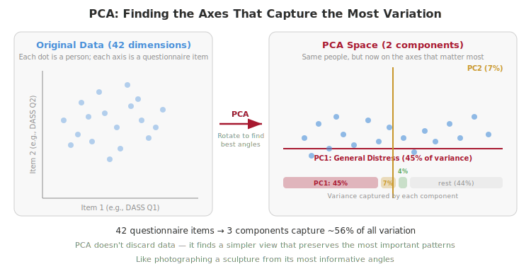
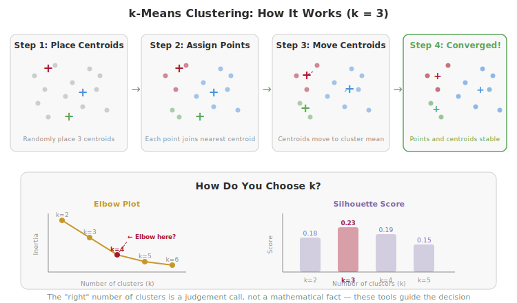

# Week 7: Discovering Structure — Clustering and Dimensionality Reduction

> **Companion reading for the Week 7 lecture.** Read this before or after the lecture — it covers the same ideas in more depth, with examples you can revisit at your own pace.

---

## Overview

For the first six weeks, every model you built had a target variable — something to predict, and a clear "right answer" to check against. This week, there's no target. No accuracy. No confusion matrix. Just data, and one question: is there meaningful structure hiding here, or are we imposing patterns on noise?

## The Shift to Unsupervised Learning

In **supervised learning** (Weeks 2–6), you always had labels — depression scores, elevated vs. minimal, at risk vs. low risk. The model learned to map features to those labels, and you measured how well it did. In **unsupervised learning**, there are no labels. Nobody has told you which group each person belongs to. Instead, you're asking the data to reveal its own structure.

This opens two main tasks: **dimensionality reduction** (simplifying complex data into something you can see and interpret) and **clustering** (discovering groups of similar observations).

If you've studied factor analysis in statistics, you've already done a version of this. Factor analysis asks "are there latent variables underlying these observed measurements?" PCA asks a similar question but with a different emphasis — rather than testing whether factors are "real" using fit indices, ML evaluates whether the structure is *stable* and *useful*.

In Week 4, you predicted depression scores from personality. This week, you'll ask a completely different question about the same dataset: are there meaningful subgroups of people who experience distress differently?

## Dimensionality Reduction: Seeing the Big Picture

The **curse of dimensionality** is an intuitive problem: the more features you have, the harder it is to find patterns. With 42 questionnaire items, every participant lives in a 42-dimensional space. You can't visualise that. You can't easily spot patterns in it. And models need exponentially more data to find reliable relationships as dimensions increase.

Dimensionality reduction finds a simpler representation that preserves the important patterns while discarding noise. Think of it like summarising a long conversation — you lose some details, but you capture the essence. The key insight is that you're not throwing away data. You're finding a more informative angle from which to view it.

## Principal Component Analysis (PCA)

PCA finds new axes — called **principal components** — that capture the most variation in your data. The first component (PC1) captures the single direction of greatest variation. PC2 captures the next most, perpendicular to PC1. And so on.

Here's an analogy: imagine photographing a coffee mug from every possible angle. Most photos would show similar features — the handle, the cylindrical shape, the opening. PCA finds the angles that show the *most different* views of the mug — the few perspectives that together give you the best overall picture.



A **scree plot** shows how much variance each component captures. The first few components typically capture a lot; the rest flatten out. Where the curve "elbows" — where it transitions from steep to flat — suggests how many components are worth keeping. For the DASS-42 questionnaire (42 distress items), the first component alone captures roughly 45% of all variation, and three components together capture over 55%. That means you can represent 42 dimensions with 3 and still retain more than half the signal.

**Loadings** tell you what each component *means*. A loading is how strongly each original variable contributes to a component. If PC1 has high loadings for every DASS item, it's a "general distress" factor — people who score high on one symptom tend to score high on everything. If PC2 has positive loadings for depression items and negative loadings for anxiety items, it captures what distinguishes depression from anxiety.

The connection to factor analysis is direct: PCA and factor analysis share the same core intuition — both find latent dimensions underlying observed variables. They differ in assumptions (PCA maximises variance explained; factor analysis models shared variance), but for this course, the distinction isn't critical. What matters is the idea: many observed variables can often be described by a few underlying dimensions.

> **Think about it #1:** A researcher runs PCA on 42 DASS items and finds 3 components. They call these "Depression," "Anxiety," and "Stress" and say they've "discovered" the three-factor structure. But those are the three subscales the questionnaire was *designed* to measure. Have they discovered structure in the data, or rediscovered something that was built into the questionnaire from the start? When does PCA genuinely reveal something new?

## UMAP and t-SNE

PCA finds **linear** relationships — it rotates the axes to maximise variance along straight lines. But what if the structure in your data is non-linear? What if groups are separated by curves rather than straight lines?

**UMAP** (Uniform Manifold Approximation and Projection) and **t-SNE** (t-distributed Stochastic Neighbour Embedding) find non-linear structure and produce 2D visualisations where similar points cluster together. They're powerful tools for *exploration* — they can reveal patterns that PCA misses entirely.


But there's a critical warning: **distances between clusters in UMAP are NOT meaningful.** Two clusters that appear far apart might actually be similar. Cluster sizes and shapes can be artefacts of the algorithm's settings, not genuine features of the data. Only **local** structure is preserved — points that are nearby in the original space stay nearby in UMAP space. Everything else is up for distortion.

UMAP is a map for exploration, not a measurement tool for inference. Use it to *generate hypotheses* about structure, not to *confirm* them. t-SNE is an older algorithm with the same purpose; UMAP is generally preferred in practice because it's faster and better at preserving global structure.

## Clustering: Finding Groups

Clustering asks: are there natural groups in this data? Points within a group should be *similar* to each other (cohesion) and *different* from points in other groups (separation).

Three main families of algorithms approach this differently: **centroid-based** methods (k-means) define clusters around central points; **hierarchical** methods build a tree of nested groups; and **density-based** methods (DBSCAN) find regions where points are packed together.

Here's the critical warning that applies to all of them: **clustering algorithms will ALWAYS find groups, even in completely random data.** If you run k-means on pure noise and ask for 3 clusters, you'll get 3 clusters. They'll look clean and well-separated. And they'll be completely meaningless. The question isn't "did I find clusters?" — it's "are these clusters real, stable, and meaningful?"

## k-Means Clustering

k-Means is the most common clustering algorithm. It works in four steps: (1) randomly place *k* centroids in the data space, (2) assign every point to its nearest centroid, (3) move each centroid to the mean position of its assigned points, (4) repeat steps 2–3 until nothing changes.



It's fast, intuitive, and usually the first method to try. But it has limitations: you must choose *k* (the number of clusters) in advance, it assumes roughly spherical clusters of similar size, and different random starting positions can give different results.

**Choosing k** is often the hardest part. Two tools help:
- The **elbow plot** shows total within-cluster distance for each value of k. As k increases, the total distance decreases (more clusters = tighter fit). Look for where the improvement slows dramatically — the "elbow" where adding more clusters stops helping much.
- The **silhouette score** measures how well each point fits its assigned cluster versus the nearest other cluster. It ranges from -1 (badly misclassified) to +1 (perfectly placed). Higher average silhouette scores suggest better-defined clusters.

Neither tool gives a definitive answer. The "right" number of clusters is a judgement call guided by these diagnostics and, crucially, by whether the clusters make **psychological sense**.

## Hierarchical Clustering

Hierarchical clustering takes a different approach. Starting with every point as its own cluster, it repeatedly merges the two most similar clusters until everything is in one group. The result is a **dendrogram** — a tree that shows the entire merge history.


The beauty of a dendrogram is that you can "cut" the tree at any height to get any number of clusters. Cut high and you get 2 broad groups. Cut low and you get many small groups. You see the full hierarchy, so you don't have to commit to a single *k* in advance.

The downside: different **linkage methods** (the rule for measuring distance between clusters) can give very different results. Single linkage, complete linkage, average linkage, and Ward's method each define "distance between clusters" differently. This is yet another source of instability in the results.

## DBSCAN

**DBSCAN** (Density-Based Spatial Clustering of Applications with Noise) takes a fundamentally different approach. Instead of defining clusters as groups around centroids or points in a hierarchy, it defines clusters as regions of high density separated by regions of low density.

DBSCAN has two parameters: **epsilon** (how close points need to be to count as "neighbours") and **min_samples** (the minimum number of neighbours required to form a cluster core). Points that don't belong to any cluster are labelled as **noise** — a feature no other algorithm we've discussed provides.

This is useful when clusters aren't spherical, when you don't know how many clusters to expect, and when some data points genuinely don't belong to any group. The weakness is that DBSCAN struggles with clusters of varying density, and the results are sensitive to parameter choices.

## Stability: Can You Trust Your Clusters?

This is the most important section in this reading.

Run k-means with a different random seed — do you get the same clusters? Run it on a random 80% of your data — do the same participants end up together? Try a completely different algorithm — do the same groups emerge?


A cluster solution that changes every time you look at it isn't a discovery — it's noise. Stability checks are not optional extras. They're the minimum requirement for taking any cluster solution seriously.

**Silhouette scores** help assess quality: for each point, how much closer is it to its own cluster centre than to the nearest other cluster? But silhouette scores only tell you about internal consistency, not about whether the solution replicates.

In psychology, cluster solutions are often unstable with moderate sample sizes. This doesn't mean clustering is useless — it means findings should be reported with appropriate uncertainty and honest descriptions of stability checks. A cluster solution that is only partially stable might still be informative, as long as you're transparent about its limitations.

> **Think about it #2:** You cluster participants into 3 groups based on their depression and anxiety patterns. You present this at a conference, and someone asks: "Did you check whether those clusters are stable?" You rerun the analysis with a different random seed and get 4 groups with different boundaries. What should you do next? What does this tell you about the "reality" of the subgroups?

## The Psychology of "Types"

Psychology has a long tradition of categorising people: personality types (introvert/extrovert), diagnostic categories (Major Depressive Disorder vs. Generalised Anxiety Disorder), learning styles (visual/auditory/kinesthetic). Some of these categories are clinically useful — diagnoses guide treatment decisions. Others lack empirical support — learning styles, for instance, have been extensively debunked.

The **taxometrics** debate asks a deep question: are psychological constructs genuinely *categorical* (you either have depression or you don't) or *dimensional* (everyone sits somewhere on a severity continuum)? A large meta-analysis by Haslam et al. (2020) found that most psychopathology constructs are dimensional, not categorical. Depression, anxiety, personality disorders — the evidence consistently favours continuums over discrete types.

Clustering can contribute to this debate, but it cannot resolve it. Because clustering algorithms always find groups — even in purely dimensional data — finding clusters is not evidence that types genuinely exist. You'd need to show that the clusters are stable, replicate across samples, correspond to meaningful outcomes (different treatment responses, different trajectories), and can't be better explained by a dimensional model.

The danger of **reification** is real: naming a cluster ("The Anxious Achiever" or "The Resilient Introvert") makes it *feel* real, even if the cluster barely survives a random seed change. Names are powerful — they create the illusion of categories where continuous variation might be a better description.

Borsboom's **network approach** offers a complementary perspective: rather than latent categories or dimensions, symptoms cause each other directly. Depression isn't a latent disease entity — it's a self-reinforcing network of mutually activating symptoms (poor sleep → low energy → social withdrawal → loneliness → sad mood → poor sleep). This view challenges both the categorical and dimensional frameworks.

> **Think about it #3:** Mental health researchers have debated for decades whether conditions like depression are discrete "types" (you have it or you don't) or points on a continuum (everyone has some level). Could clustering analysis settle this debate? What would you need to see in the data to be convinced that discrete types genuinely exist?

## Common Misconceptions

- **"PCA discovers hidden factors."** PCA finds linear combinations that maximise variance. Whether these correspond to meaningful psychological constructs depends on interpretation, not mathematics.
- **"More clusters = better model."** Adding clusters always improves fit on the training data. The question is whether additional clusters are stable and meaningful — not whether they reduce within-cluster distance.
- **"UMAP shows the true structure of the data."** UMAP is optimised for visualisation. It can distort distances, densities, and cluster boundaries. Treat it as a sketch, not a photograph.

## Getting Ready for Week 8

Next week, you'll apply PCA and clustering to the same DASS-42 dataset you used in Week 4. Same data, completely different question. In Week 4, you asked "can personality predict depression scores?" Now you'll ask "are there meaningful subgroups in how people experience distress?"

**Data:** You may still have the dataset from Week 4. If not:
```
conda activate ai-behsci
cd weeks/week-08-lab/data
python download_data.py
```

**New LLM skill — Documentation:** In Week 2 you learned prompting, in Week 4 you learned debugging, in Week 6 you learned refactoring. This week's skill is **documentation** — asking your AI assistant to help write clear, accurate descriptions of your analysis. In research, your analysis is only as good as your ability to explain it. The AI's draft is a starting point — you need to verify that every number, method name, and description matches what you actually did. Documentation that doesn't match the analysis is worse than no documentation at all.

---

*[Back to course overview](../../README.md)*
