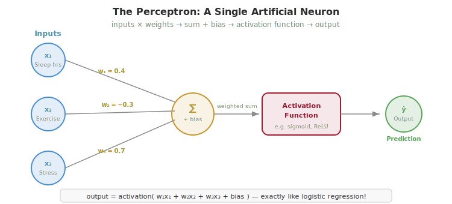
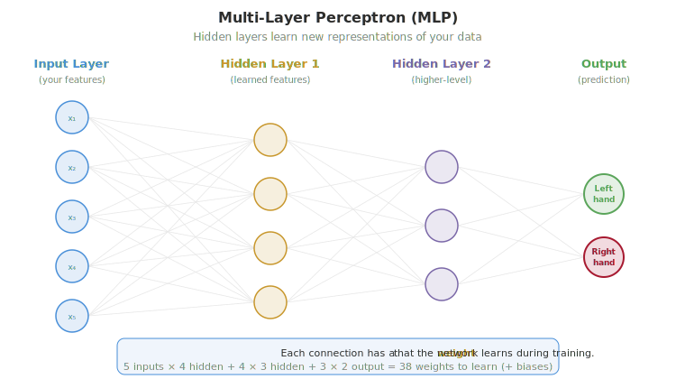
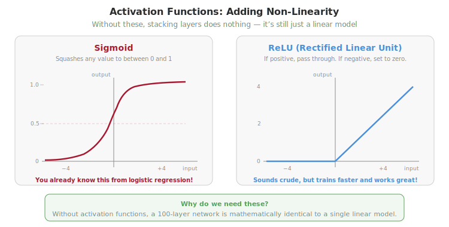
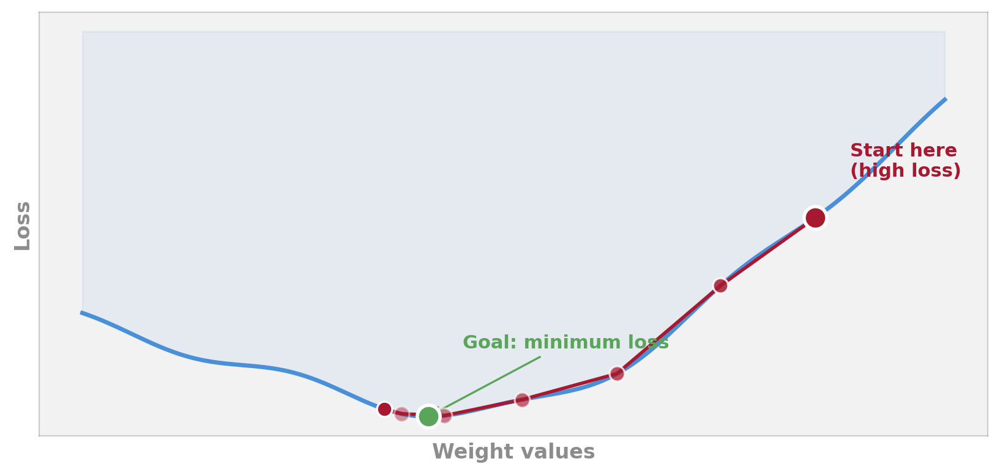
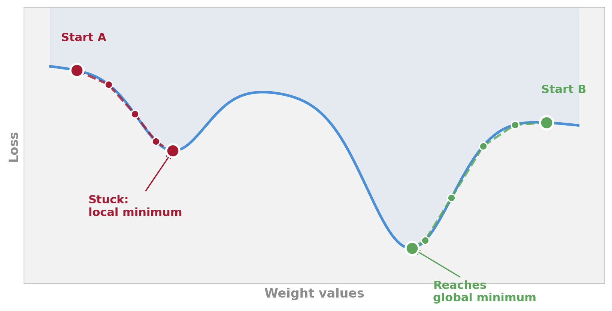
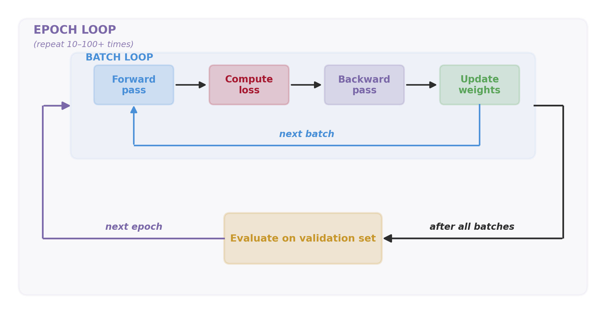
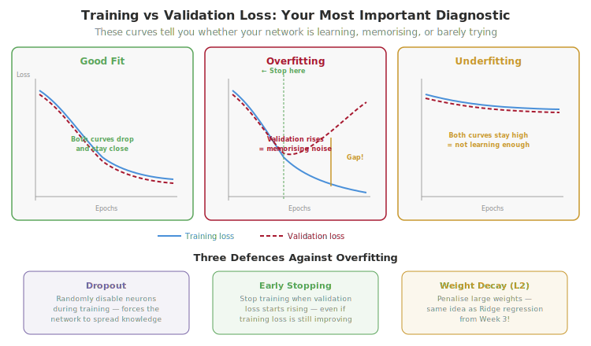

# Week 9: Learning Representations: Neural Networks as Psychological Tools

> **Companion reading for the Week 9 lecture.** Read this before or after the lecture. It covers the same ideas in more depth, with examples you can revisit at your own pace.

---

## Overview

This week we meet the most flexible (and most dangerous) family of models: neural networks. Every model you've used so far (linear regression, logistic regression, decision trees, random forests) works with the features you give it. Neural networks are different: they learn their own internal representations. This is powerful (they can discover patterns you wouldn't think to engineer) and risky (they need more data, are harder to interpret, and can overfit spectacularly). The key question isn't "can a neural network fit this data?" (the answer is almost always yes) but "should you use one?"

## What Is a Neural Network?

Start with the simplest possible neural network: a single artificial neuron, called a **perceptron**. It takes inputs (your features, say sleep hours, exercise, and stress level), multiplies each by a **weight** (a number that says how important that input is), adds them all up plus a **bias** term, and passes the result through an **activation function** to produce an output.



This should feel familiar. A perceptron is mathematically identical to what you've already seen: logistic regression is a perceptron with a sigmoid activation function. Linear regression is a perceptron with no activation function at all. You already know how this works; the only new vocabulary is "neuron," "weight," and "activation."

A brief note on the name: despite being called "neural networks," these models are **not models of the brain**. They were loosely inspired by biological neurons in the 1940s, but a real neuron has thousands of connections, operates with electrical spikes rather than continuous numbers, and works in networks of 86 billion. The biological analogy is useful for initial intuition but misleading as a literal description.

## From One Neuron to Many: Multi-Layer Networks

A single neuron can only learn linear relationships, the same limitation as logistic regression. The interesting part is what happens when you connect many neurons together in layers.

A **multi-layer perceptron** (MLP) arranges neurons in three types of layers: an **input layer** (your features go in), one or more **hidden layers** (where the network learns new representations), and an **output layer** (the prediction comes out). Every neuron in one layer connects to every neuron in the next.



The hidden layers are where the interesting work happens. Each neuron in a hidden layer computes a weighted combination of its inputs and applies an activation function, creating a new, learned feature that didn't exist in your original data. With enough hidden neurons, a neural network can approximate virtually any function. This is called the **universal approximation theorem**, and it sounds impressive, but it's also dangerous. A model that can learn any pattern can also learn noise.

For tabular data like psychology surveys, one or two hidden layers is usually enough. The deep networks you hear about in the news (with dozens or hundreds of layers) are designed for images, audio, and text, not spreadsheets.

### What "learning representations" actually means

This is the idea hiding inside the title of this week's lecture, and it's worth pausing on. Every model you've used so far has been fed features that *you* (or the data collector) chose: a sleep score, a DASS sum, a personality factor. The model's job was to combine those features into a prediction. A neural network does that *and* something else: in each hidden layer, it learns its **own** features — its own way of describing the input.

What does that look like in practice? Imagine a network learning to predict depression severity from a 30-item questionnaire. The first hidden layer might learn a neuron that fires strongly when items 3, 7, and 12 are all elevated — essentially detecting "anhedonia symptoms" without ever being told that concept. The next layer might combine *that* neuron with a "low energy" neuron and a "social withdrawal" neuron to produce a higher-level pattern like "depressive cluster." Crucially, **nobody designed these neurons**; the network discovered them because they made the predictions more accurate. This is what "representation learning" means: the network learns *how to see the input*, not just how to map it to an output.

This is also why neural networks dominate domains like vision and language. A pixel by itself means nothing; whether a pixel belongs to "a cat" or "the letter A" depends on patterns of pixels. Hand-engineering those features is hopeless. A neural network learns them. The same idea underpins **word embeddings** and large language models — but that's a story for Week 11.

> **Think about it #1:** Neural networks were inspired by biological neurons. But a real neuron has thousands of connections, operates with electrical spikes (not continuous numbers), and works in networks of 86 billion. Given these differences, is calling these models "neural networks" helpful or misleading? Does the name affect how people think about what these models can and can't do?

## Activation Functions: Why Non-Linearity Matters

Without activation functions, stacking layers does nothing. Mathematically, multiplying matrices and adding biases is still a linear operation; a 100-layer network without activations is identical to a single linear model. Activation functions break this linearity.



You already know one: **sigmoid** squashes any value to between 0 and 1. It's the same function from logistic regression: same purpose, same shape. The other common activation is **ReLU** (Rectified Linear Unit): if the input is positive, pass it through unchanged; if negative, set it to zero. This sounds crude, but ReLU trains faster than sigmoid and works remarkably well in practice.

The intuition: activation functions let the network model curved, complex relationships rather than straight lines. Each layer applies a non-linear transformation, and stacking these transformations lets the network learn increasingly abstract representations.

## How Neural Networks Learn

The network starts with random weights and makes terrible predictions. Training adjusts those weights to reduce errors, step by step. The process has four phases that repeat thousands of times:

1. **Forward pass** — Feed data through the network, get a prediction.
2. **Loss** — Measure how wrong the prediction was (cross-entropy for classification, mean squared error for regression; you already know these from previous weeks).
3. **Backward pass** — Compute how to adjust each weight to reduce the loss. This is called **backpropagation**. The idea: once you know the total error at the output, you can ask "how much did *each* weight in the previous layer contribute to that error?" Then "how much did each weight in the layer before that contribute?" The blame gets passed backwards, layer by layer, until every weight has a personalised correction. The maths is just the chain rule from calculus — you don't have to implement it, PyTorch does it automatically.
4. **Update** — Nudge each weight slightly in the direction that reduces the loss. Repeat.

The algorithm that guides this process is called **gradient descent**. Imagine standing on a hilly landscape in thick fog. You can't see the lowest point, but you can feel which direction slopes downhill under your feet. Take a small step downhill, feel again, repeat. You'll eventually reach a valley, though not necessarily the deepest one.



The **learning rate** controls how big each step is. Too big, and you overshoot the valley and bounce around chaotically. Too small, and you barely move; training takes forever and you might get stuck in a shallow dip instead of finding the deep valley.

### Local vs Global Minima

That "shallow dip" deserves more attention. A real loss landscape for a neural network has many valleys, not just one. The **global minimum** is the deepest valley — the very best the network could do on the training data. A **local minimum** is any other valley: a place where every nearby step goes *up*, even though there's a deeper valley somewhere else on the landscape. Once gradient descent reaches a local minimum, it stops moving — the slope under its feet is flat — and it has no way of knowing a better valley exists elsewhere.



In the figure above, the same algorithm starts from two different places. Trajectory A starts on the left ridge and rolls into the shallower valley on the left — it gets stuck. Trajectory B starts on the right ridge and finds the deeper, true minimum. The only difference is the **starting point** (the network's random initial weights).

So how do real neural networks avoid this trap? Several things work in our favour, and you'll see all of them in Week 10:

- **Mini-batch noise.** Computing the gradient on a small batch (32 examples) rather than the whole dataset gives a *noisy* estimate of the slope. That noise occasionally bumps the model out of shallow valleys — the same way a marble shaken gently will roll out of a small dip and into a deeper one.
- **Momentum / Adam.** Modern optimisers (you'll use **Adam** in Week 10) don't just follow the current slope — they carry **momentum** from previous steps. That momentum can roll the model right through shallow local minima.
- **Multiple random initialisations.** In practice, researchers often train the same network several times from different random starting weights and keep the best result. Different starts mean different trajectories, and at least one usually lands in a good valley.
- **High-dimensional landscapes have fewer true local minima than you'd think.** This is the surprising part. In two dimensions (like the figure), local minima are everywhere. But neural networks have thousands or millions of weights — millions of dimensions. In that many dimensions, points that *look* like local minima are usually **saddle points** instead: flat in some directions but downhill in others. Gradient descent can keep moving through them. This is why deep learning works in practice, despite the theoretical worry about local minima.

The takeaway: getting stuck in a truly bad local minimum is rare in modern neural network training. What's much more common — and what you'll need to diagnose in Week 10 — is the network *appearing* stuck because the learning rate is wrong, the initialisation was unlucky, or the data has no signal to learn from.

> **Think about it #2:** A research team trains a neural network to predict therapy outcomes from intake questionnaires. It achieves 78% accuracy, compared to 74% for logistic regression. They conclude the neural network is "superior" and recommend deploying it in clinical practice. What questions would you want to ask before agreeing? Think about sample size, interpretability, and what a 4-percentage-point difference means for patients.

## Training in Practice

Three terms you'll encounter repeatedly:

- **Epoch:** One full pass through all the training data. You typically need 10–100+ epochs for the network to learn.
- **Batch:** Instead of computing the loss on all data at once, process small batches (e.g., 32 or 64 examples). This is faster and the noise from small batches can actually help the network escape shallow valleys (see the local-minima discussion above).
- **Learning rate schedule:** Start with a moderate learning rate, then reduce it as training progresses, like taking smaller, more careful steps as you approach the valley floor.

Put together, training is two **nested loops**: an outer loop over epochs, and an inner loop over batches. The four-step pipeline (forward → loss → backward → update) runs inside the batch loop. After each epoch finishes, the network is evaluated on a held-out validation set before starting the next epoch.



The same loop in pseudocode — the version you'll see translated into PyTorch in Week 10:

```text
For each epoch:
    For each batch of data:
        1. Forward pass → prediction
        2. Compute loss
        3. Backward pass → gradients
        4. Update weights
    Evaluate on validation set
```

### A note on optimisers

The "update weights" step is run by an **optimiser**. The simplest is plain **stochastic gradient descent (SGD)**: step in the direction of the negative gradient, scaled by the learning rate. Modern training almost always uses something smarter. The default you'll meet in Week 10 is **Adam** — short for "adaptive moment estimation." Adam keeps a running average of recent gradients (its **momentum**) and adapts the effective learning rate for each weight individually. The practical effect: Adam usually trains faster than plain SGD, copes better with awkward learning-rate choices, and is more forgiving when the loss landscape is messy. You won't need to implement it; you just call `torch.optim.Adam(model.parameters(), lr=0.001)` and PyTorch does the rest.

### Knowing when to stop

Monitor **validation loss** alongside training loss. When validation loss starts rising while training loss keeps falling, you're overfitting. Stop there.

## Overfitting in Neural Networks

Neural networks have many parameters. Even a small network (320 inputs, one hidden layer of 64 neurons, 2 outputs) has over 20,000 weights to learn. With that many adjustable knobs, the network can memorise training data rather than learning generalisable patterns.



The training vs validation loss plot is your most important diagnostic tool. Three patterns to recognise:

- **Good fit:** Both curves drop and stay close together. The network is learning genuine patterns.
- **Overfitting:** Training loss keeps dropping, but validation loss starts rising. The network is memorising noise.
- **Underfitting:** Both curves stay high and flat. The network isn't learning enough. Maybe it's too small, the learning rate is wrong, or the data doesn't contain the signal you're looking for.

Three defences against overfitting:

1. **Dropout:** Randomly disable some neurons during training. This forces the network to spread its knowledge across many neurons rather than relying on a few. Analogy: studying with random pages of your textbook covered, so you can't rely on any single source, so you develop a more robust understanding.
2. **Early stopping:** Monitor validation loss and stop training when it starts increasing, even if training loss is still improving.
3. **Weight decay (L2 regularisation):** Penalise large weights. This is the same idea as Ridge regression from Week 3. You've seen this principle before.

## When Should You Use a Neural Network?

Neural networks shine when: data is large (thousands or more observations), relationships are complex and non-linear, and raw inputs have meaningful patterns (images, audio, EEG signals, text).

They struggle when: data is small (typical psychology study: 100–300 participants), features are already well-engineered (survey composite scores), and interpretability matters (clinical decisions).

The honest truth: for most tabular psychological data, a well-tuned logistic regression or random forest will match or beat a neural network. You'll see this firsthand in Week 10, where the neural network might barely outperform (or even underperform) the logistic regression baseline on EEG data. Neural networks earn their keep on large-scale, high-dimensional data, not on spreadsheets.

**Rule of thumb:** If your data fits in a spreadsheet and has fewer than 20 features, start with logistic regression or a random forest. Only try a neural network if those aren't working and you have enough data to support the added complexity.

> **Think about it #3:** Your supervisor has a dataset of 200 participants who completed personality questionnaires and cognitive tasks. They've heard that "deep learning is more powerful" and suggest using a neural network. What advice would you give? When does a neural network genuinely help with psychological data, and when is it overkill?

## Neural Networks in Psychology and Cognitive Science

Despite the caveat above, neural networks have genuine applications in psychology:

- **Brain-computer interfaces (BCI):** Classifying imagined movements from EEG signals, and you'll do this in Week 10. The neural network learns which patterns of brain activity correspond to "imagining left hand movement" vs "imagining right hand movement." This technology helps people with paralysis communicate and control devices.
- **Neuroimaging:** Classifying mental states from fMRI patterns. Detecting early signs of Alzheimer's from brain scans. The high dimensionality of brain data (thousands of voxels) is where neural networks can add value over simpler models.
- **Computational models of cognition:** Connectionist models are neural networks used as *theories* of how the mind works, simulating how the brain processes language, memory, and learning. These aren't prediction tools; they're scientific models of cognitive processes.
- **Digital phenotyping:** Predicting mental health from smartphone sensor data (accelerometer, GPS, typing patterns). Neural networks can combine these diverse, high-frequency signals in ways that linear models cannot.

The key distinction: using neural networks as *tools* (predicting from data) vs as *models* (simulating cognitive processes). Both are legitimate but serve very different purposes.

> **Think about it #4:** A brain-computer interface uses a neural network to classify imagined hand movements from EEG. It works at 70% accuracy, above chance (50%) but far from perfect. A company wants to use it for controlling prosthetic limbs. What accuracy would you need for this to be safe? What are the stakes of getting it wrong, and how do they compare to the stakes of a depression screening tool that's also 70% accurate?

## Common Misconceptions

- **"Neural networks are like the brain."** They're inspired by neuroscience but vastly simpler. A neural network is a mathematical function, not a cognitive model (unless you're deliberately using it as one; see connectionism above).
- **"Deep learning always beats classical ML."** On tabular data with moderate samples, classical methods often win. Deep learning's advantage emerges with large-scale, high-dimensional data like images, audio, and text.
- **"More layers = smarter model."** More layers means more parameters, which means more risk of overfitting. Use the least complex architecture that works.

## Getting Ready for Week 10

Next week, you'll build and train a neural network from scratch using **PyTorch**, a Python library for deep learning. Your task: classify imagined hand movements (left vs right) from EEG brain signals. You'll compare the neural network to a logistic regression baseline and honestly assess whether the added complexity was worth it.

**Data:** Pre-extracted features from 109 participants' EEG recordings. Download before class:

```bash
conda activate ai-behsci
cd weeks/week-10-lab/data
python download_data.py
```

**New LLM skill — Complex debugging:** In Week 2 you learned prompting, in Week 4 debugging, in Week 6 refactoring, in Week 8 documentation. This week's skill is **complex debugging** — diagnosing problems when there's no error message, just a model that silently fails. When your neural network's loss stays flat at 0.693 (the loss for random guessing on two classes), the AI can't diagnose the problem from a traceback. You need to describe the *symptoms*: what the loss curve looks like, what you expected, what the data looks like. This is the hardest debugging skill yet.

---

*[Back to course overview](../../README.md)*
