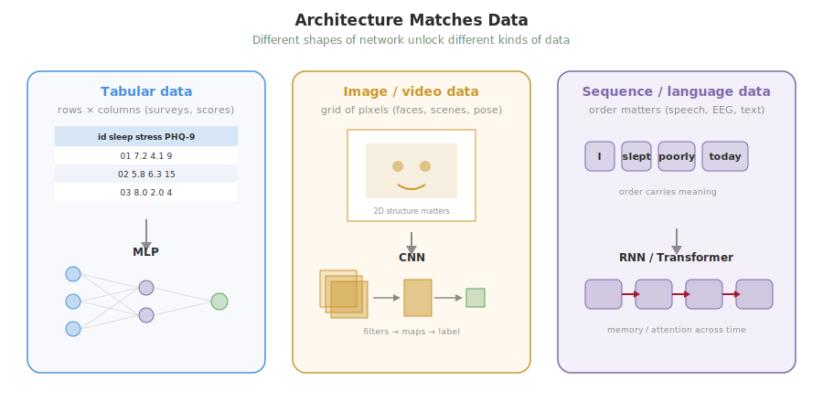
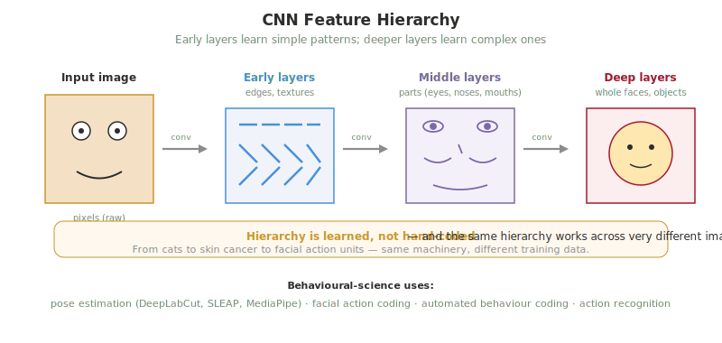
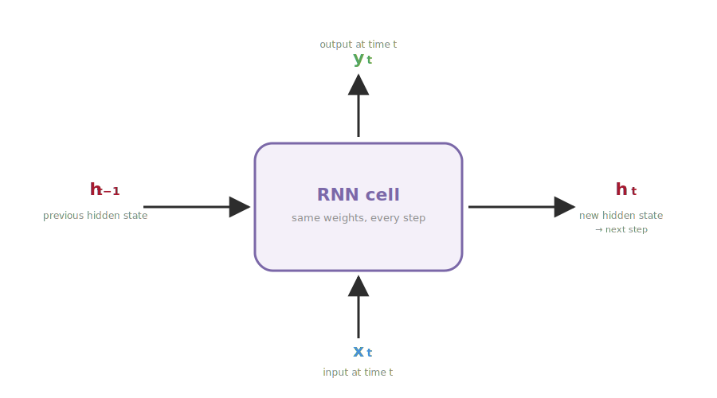
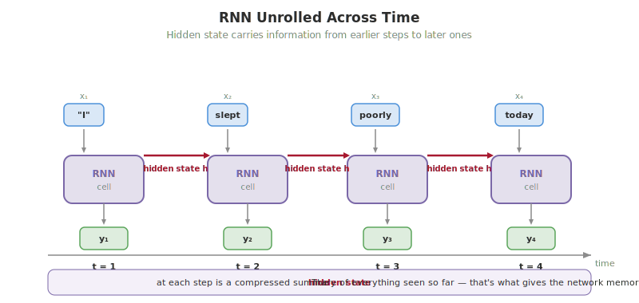
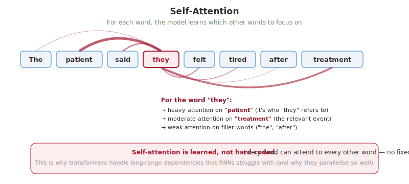

# Week 11: Beyond Tabular — Deep Learning, LLMs and Generative AI

> **Companion reading for the Week 11 lecture.** Read this before or after the lecture. This is the broadest week of the course — we move past spreadsheets into images, video, sequences and language, and we crack open the lid on the AI tools you have been using all semester.

---

## Overview

For ten weeks, every dataset you have touched has been *tabular*: rows of participants, columns of variables, one observation per row. In Week 10 you trained a small multi-layer perceptron (MLP) on EEG features and saw that even with a "deep" model, the data still arrived as a flat vector. This week we lift that constraint. We meet the three families of network architecture that unlock everything else — images, video, time series, and language — and we trace how those same architectures power the AI tools that have arrived in psychology over the last five years.

Two arcs run through the lecture. The first is technical: **architectures match the data**. A network that respects the structure of an image, or the order of a sequence, can learn things a flat MLP just cannot. The second is methodological: deep learning very rarely replaces the classical ML you have learned. Instead, it sits *upstream* — turning raw video, audio, or text into the kind of clean numerical features you can feed into a logistic regression or random forest. By the end of the lecture you should be able to point at a real research workflow (such as the cognitive-load study below) and say which bit is "deep" and which bit is the Week 6 toolkit you already know.

## Architectures Match the Data

In Week 10 you built an MLP — a stack of fully-connected neurons that takes a flat vector in and produces a prediction. That works for tabular data because, in a spreadsheet, the order of the columns does not really matter and there is no spatial geometry to preserve. Sleep hours and exercise hours could swap positions and the model could be retrained without losing anything.

But most of the data the world actually produces has *structure* that a flat MLP throws away.

- **Images** have **spatial** structure: nearby pixels belong to the same object. A pixel in the top-left corner is meaningful in part because of the pixels immediately around it, not because it is the 17,328th number in a long list.
- **Speech, EEG, gesture trajectories** and other time series have **temporal** structure: the order of values matters. "She fell asleep before the alarm" and "The alarm sounded before she fell asleep" use the same words, but a model that ignores order cannot tell the difference.
- **Language** has both at once — local structure (the word right before this one matters a lot) *plus* long-range dependencies (a pronoun ten sentences later might still refer back to the original noun).

If you flatten an image into a long vector and feed it to an MLP, every spatial relationship is lost. The pixel for "left eye" and the pixel for "right eye" become two arbitrary slots in a 200,000-element list. The MLP can sometimes still learn the task — but it has to learn the spatial relationships from scratch, which takes orders of magnitude more data than it would if the architecture *built that structure in*.

That is the big idea this week: **when the architecture matches the structure of the data, fewer parameters do more**. The network can *learn* useful features rather than having them engineered by hand, and it can do so from realistic amounts of data. The three architecture families below — CNNs, RNNs/LSTMs, and transformers — each match a different kind of structure.

## Convolutional Neural Networks

A **convolution** is a small learnable filter — typically a grid of nine numbers in a 3×3 pattern — that slides across an image and produces a new image showing where that pattern appears. Picture a small magnifying glass that, instead of magnifying what is underneath it, returns a single number: *how strongly does what I am looking at right now match my pattern?* You drag that magnifying glass left-to-right, top-to-bottom, across the whole image, recording the number at every position. The result is a new image — an **activation map** — that is bright wherever the pattern was present and dark wherever it was not.

What does the filter detect? Whatever the network has learned to detect. A filter whose numbers are arranged so that the left column is negative and the right column is positive will respond strongly to **vertical edges** — places where the image goes from dark to light from left to right. The slide deck walks through a single 3×3 vertical-edge filter sliding across a simple letter-shape image; the activation map lights up exactly where vertical edges live in the image, and is dark everywhere else. Other filters might learn to detect horizontal edges, particular textures, blobs of a certain colour, or curves of a certain shape. The key thing is that **nobody designs these filters**. They start as random numbers and the training process — gradient descent and backpropagation from Week 9 — gradually adjusts them until the network's predictions improve. The filters that survive training are the ones that detect things the network found useful.

A single convolutional layer has hundreds of filters running in parallel, all learned from data. Each filter produces its own activation map, so a layer that starts with one image and uses 64 filters produces 64 activation maps — 64 different views of the same image, each highlighting a different pattern.

Stacking convolutional layers builds a **hierarchy of features**. Early layers detect the simplest things — edges, textures, blobs of colour. Middle layers combine those into *parts*: an eye-shaped arrangement of edges and a curve might be detected as "an eye"; a wheel-shaped arrangement might be detected as "a wheel". Later layers combine those parts into *whole objects*: a face, a car, a particular posture. This compositional hierarchy is not built in — it *emerges* from the training data. **Pooling** layers between the convolutions shrink the activation maps (typically by taking the maximum value in each 2×2 patch), which both reduces compute and lets deeper layers "see" a wider region of the original image with the same-size filter.

CNNs were a niche idea for decades. The moment they took over computer vision came in 2012, when [Krizhevsky, Sutskever and Hinton (2012)](https://doi.org/10.1145/3065386) entered a deep CNN — soon nicknamed *AlexNet* — into the ImageNet competition. The task was to classify each of 1.2 million photos into one of 1,000 categories. The previous year's winning system had an error rate around 26%. AlexNet brought it down to 15%, an enormous jump in a field that had been measuring progress in tenths of a percent. Within five years CNNs dominated every major image task, and they began spreading into medical imaging, satellite analysis, neuroscience, and — most relevant to us — behavioural science.

## CNNs in Behavioural Science

For psychology and behavioural science, CNNs power a new generation of measurement tools. The recurring theme: tasks that used to require specialised, expensive hardware (motion-capture rigs, electrode caps, specialist coders) can now run from ordinary video.

- **Marker-less pose estimation.** DeepLabCut ([Mathis et al., 2018](https://doi.org/10.1038/s41593-018-0209-y)), SLEAP ([Pereira et al., 2022](https://doi.org/10.1038/s41592-022-01426-1)), OpenPose ([Cao et al., 2019](https://doi.org/10.1109/TPAMI.2019.2929257)) and MediaPipe use CNNs to localise body landmarks — eyes, shoulders, elbows, hips, knees — in video, frame by frame. No reflective markers, no infrared cameras, no calibrated rigs. Just a phone camera and a trained network. DeepLabCut and SLEAP have transformed animal behaviour research; OpenPose and MediaPipe are becoming defaults in human motor and developmental labs.
- **Facial expression analysis.** Automated **Facial Action Coding** (FACS) detects individual facial-muscle movements — called **Action Units** — in real time from video, replacing what used to be hours of frame-by-frame manual coding. Action Units are well-defined and measurable; they have decent reliability between trained human coders. The more controversial step is inferring discrete **emotion categories** from combinations of Action Units. [Barrett et al. (2019)](https://doi.org/10.1177/1529100619832930) offers a thorough critique of the assumption that "anger" or "fear" reliably maps onto a particular facial configuration across cultures and contexts. The honest position for psych research: trust automated AU detection more than you trust the emotion label sitting on top of it.
- **Action recognition and automated behaviour coding.** Given a video clip, what is the person doing? Walking, reaching, gesturing, falling. This is replacing thousands of hours of manual video review in observational studies — mother-infant interaction coding, autism behavioural markers, motor symptoms in Parkinson's, fall detection in aged care.

A word about **trust**, because this matters for psych research. Before you treat an automated coder as a substitute for human raters, you have to validate it the same way you would validate any two humans coding the same videos: report **inter-rater reliability** between the model and a sample of human coders, typically using **Cohen's kappa** (for categorical codes) or the **intraclass correlation coefficient** (for continuous ones). The CNN does not get a free pass because it is fast. If kappa between the model and trained humans is poor, the model is not ready, no matter how impressive its accuracy on the developers' benchmark. This is exactly the same standard you would apply to a research assistant joining a coding team.

> **Think about it #1:** Pose estimation has made behavioural research dramatically cheaper and faster — a single laptop can now do what once needed an expensive motion-capture lab. What does this mean for the kinds of studies that get done? Does it widen access to good methods, change *which* questions get asked, or both?

## Top-Down vs Bottom-Up Pose Estimation

Worth a brief detour: there are two broad ways to estimate pose from an image, and the difference shows up in the tools you might pick.

**Top-down** methods detect *people* first — drawing a bounding box around each person in the frame — and then run a pose estimator inside each box. Examples include **HRNet**, **AlphaPose**, and **ViTPose**. Because each pose is estimated on a cropped, person-centred image, top-down methods tend to be **highly accurate**, but their compute scales with the number of people in the frame — twenty people in shot means twenty separate pose estimations.

**Bottom-up** methods do the opposite: detect *all* keypoints in the image first (every left-shoulder, every right-knee, every nose), and then group them into people in a second step. **OpenPose** and **MediaPipe** are the canonical examples. The compute cost is roughly constant regardless of how many people are in the frame, which makes bottom-up faster in crowded scenes; but the grouping step is hard and tends to make more mistakes when people overlap.

Both approaches end up producing the same kind of output — a list of (x, y) keypoints for each person — so for downstream analysis the choice often comes down to the practical constraints of your study: how many people are typically in shot, how much compute you have, and whether you need real-time output.

## Case Study: Pose Estimation for Cognitive Load

Suppose you want to study **cognitive load** — when participants are mentally taxed by a difficult task, do their body movements change in detectable ways? Plenty of theory says yes (head stillness, blink rate, postural micro-movements have all been linked to mental effort). The problem has always been *measurement*: capturing those movements precisely used to require motion-capture suits, infrared markers, and calibrated camera rigs costing tens of thousands of dollars. That sort of setup keeps the question expensive and the samples small.

The new workflow swaps the hardware for a CNN.

1. **Record** participants doing the task with an ordinary phone or webcam. No markers.
2. **Run a CNN-based pose model** (DeepLabCut, MediaPipe, OpenPose) to extract (x, y) keypoints for every joint in every frame — typically thirty-three keypoints per body in MediaPipe.
3. **Engineer kinematic features** from the keypoint stream: head root-mean-square rotation per trial, blink aperture, postural sway, hand-movement smoothness, gaze position. These are summary numbers calculated from the raw keypoints, one per trial per participant.
4. **Feed those features into a classical ML model** — random forest, logistic regression — exactly the kind you built in Week 6.
5. **Predict cognitive-load state** on each trial.

Notice the shape of this pipeline: **deep learning extracts features; classical ML uses them.** The CNN replaces the motion-capture hardware; the downstream model is the same logistic regression you have been training since Week 5. Most applied behavioural-science pipelines using deep learning look like this. Deep learning and classical ML are not rivals — they are different layers of the same workflow.

A current example of this workflow in our own group is **Patil et al. (under review)** — a study using pose estimation to classify cognitive workload. Participants (N = 49) completed the **OpenMATB** task battery, which combines four concurrent sub-tasks (system monitoring, tracking, communications, and resource management) to load attention in a controlled way. Each participant was tested across three workload conditions — Low, Moderate, and High — and the session captured **synchronised recordings** of task performance, eye-tracking, heart rate and skin-conductance response, and webcam video for pose. From the webcam video, MediaPipe keypoints were turned into a small set of pose features: head RMS rotation (how much the head was rotating around its average position), blink aperture (eye-opening derived from face keypoints), and postural sway (the variability of upper-body position over time). The headline result: pose features track workload changes across Low / Moderate / High in much the same way the more expensive physiological measures do. Workload shows up in *every* modality — performance, physiology, eye, and pose — and the pose pipeline costs effectively nothing beyond a laptop and a webcam.

The lecture also includes a short live demo: you can run the same MediaPipe pose model in your own browser, on your own webcam, and watch it tag your joints in real time as you move. It is genuinely useful to see — the model is fast (real-time on a laptop), and watching it makes the abstract idea of a "CNN extracting keypoints" much more concrete. It also makes the failure modes more concrete: hold your hand in front of your face and notice what happens to the model's confidence; turn sideways and watch it lose track of joints on the far side.

> **Think about it #2:** A research team uses a CNN to score facial expressions in clinical interviews, replacing two human raters. The model agrees with humans 85% of the time. They publish faster, sample more participants, and improve statistical power. What is lost? What is gained? When would you trust the model over the humans — and does the answer change if the model was trained on a population that doesn't look like yours?

## Recurrent Networks and LSTMs

For sequence data — speech, EEG, gesture trajectories, language — the network needs **memory**. What it saw earlier should influence what it predicts now. A flat MLP cannot do this: it gets one fixed-size input vector and produces one output. We need something that can take in a stream.

A **recurrent neural network (RNN)** does this by passing a **hidden state** from one time step to the next. Imagine a small network that you apply once per time step: at each step it takes in two things — the current input (today's value in the time series) and the hidden state from the previous step (a vector summarising "everything I have seen so far"). It produces two things — an output for this step, and an updated hidden state to pass to the next step. The same small network gets applied step after step, threading the hidden state through.

That is the whole idea. Conceptually elegant. The word "memory" here is doing some work, though: it is not human memory or anything like it — it is just a vector of numbers (typically a few hundred long) that gets passed forward and updated at each step. Whatever the network needs to "remember", it has to compress into that vector.

If you take that same cell and apply it once per time step, threading the hidden state forward, you can lay the whole computation out as one long flat picture. This *unrolled* view makes it easier to see that the same network is being applied repeatedly — only the inputs and the hidden state change from step to step.

In practice, vanilla RNNs have a serious problem on long sequences. When you train them with backpropagation (Week 9), the learning signal has to travel back through every time step. Across many steps, the signal either **shrinks toward zero** — known as the **vanishing gradient problem**, the network effectively *forgets* anything older than the last ten or twenty steps — or **explodes upward**, in which case training becomes unstable. Vanilla RNNs work fine on short sequences but struggle past about twenty time steps. For speech, EEG, and language, that is far too short.

The fix was the **Long Short-Term Memory (LSTM)** unit, introduced by [Hochreiter and Schmidhuber (1997)](https://doi.org/10.1162/neco.1997.9.8.1735) and largely ignored for two decades before becoming the workhorse of sequence modelling. An LSTM is still a recurrent cell — same idea of threading a state through time — but with two additions. First, there is a separate **cell-state highway** that runs along the top of the cell, designed so that information can pass through many time steps with very little change. Gradients can flow back along this highway without vanishing or exploding, which solves the long-range learning problem. Second, the cell has **three learned gates** — small sub-networks that control what flows where:

- The **forget gate** decides what to drop from the cell state ("I no longer need to remember the topic of the conversation from twenty seconds ago").
- The **input gate** decides what new information from the current step to write into the cell state ("This new word matters, store it").
- The **output gate** decides what part of the cell state to expose to the rest of the network on this step ("Right now, the model needs the verb tense, but not the speaker's name").

All three gates are *learned from data* — nobody tells the LSTM what to forget or what to keep. It works out the policy from the training task. The combination of the gates and the cell-state highway made it possible to learn dependencies hundreds of time steps long, and that was enough to power speech recognition, machine translation, and music generation for nearly two decades. Transformers (next section) have replaced LSTMs for the biggest language tasks, but LSTMs remain the workhorse for medical signals like EEG, where the data is smaller and the temporal structure is precisely what the model needs to learn.

## Sequence Models in Psychological Research

LSTMs and their variants show up across psych and clinical research wherever you have ordered data.

- **Speech recognition.** Until around 2020, all major speech-to-text systems were RNN/LSTM-based. Now used downstream of those systems in clinical voice analysis, child language research, and acoustic markers of depression and Parkinson's disease.
- **EEG and physiological signals.** Sequence classifiers for brain-computer interface (BCI), sleep staging, seizure detection. LSTMs still dominate medical signals because the dataset sizes are typically too small for transformers to outperform them.
- **Gesture and gait.** Classifying movements over time, predicting next movements. Fall prediction in aged care, intent prediction in BCI, motor-intent prediction in rehab.

A direct psych example sits in our own group's work: [Auletta et al. (2023)](https://doi.org/10.1038/s41598-023-31807-1) used an LSTM to predict **next-target choice** in a multi-agent **herding** task. The setup: pairs of players (some expert, some novice) stood around a large multi-touch table and cooperatively *herded* four moving targets into a containment zone — a deliberately under-determined task where each player constantly chose which target to pursue next. Player kinematics (position, velocity) and target states were recorded at 60 Hz, and an LSTM was trained on short sequence windows to predict which target each player would select next. The headline result: across both skill levels and at two prediction horizons (short and long), the model achieved **90–97% accuracy** on the next-target choice. More striking still, the model's predictions often **preceded the player's own conscious decision** — the kinematics gave away the next choice before the chooser was aware they had made it. For psychology, this is a beautiful result: it suggests that decisions live in movement before they live in awareness, and modern sequence models are precise enough to detect that.

## A Bridge to Transformers

The architecture that has eaten the world over the past five years is the **transformer**, introduced in [Vaswani et al. (2017)](https://arxiv.org/abs/1706.03762). Its core trick is **self-attention**: for each element in the sequence, the model looks at *every* other element and learns how much each one matters. No recurrence, no fixed-distance limit on dependencies, and — crucially — fully parallel on a GPU, which means transformers can be trained on far larger datasets than RNNs ever could.

Transformers are the architecture behind every current large language model and, via the Vision Transformer, increasingly the architecture behind image models too. Because every current LLM is a transformer, the rest of this reading covers transformers by going through how a sentence gets processed inside a modern LLM — tokens, embeddings, attention, and the post-training that makes it talk like an assistant.

## Tokens and Embeddings

An LLM does not process letters or whole words. It processes **tokens**, which are typically *subwords*. The first thing that happens to any prompt is **tokenisation**: the text gets split into a sequence of tokens, and each token becomes an integer ID.

A typical model has a vocabulary of around 30,000 to 100,000 tokens, learned from data. Common words like `the` are a single token. Long or rare words get split: `psychology` might become `psych` + `ology`. This **subword tokenisation** handles new compounds and rare words gracefully — even a word the model has never seen in training can be broken into pieces it has.

Concretely: the sentence *"Studying psychology is rewarding."* might tokenise to eight tokens — `Study`, `ing`, ` psych`, `ology`, ` is`, ` reward`, `ing`, `.` — each of which maps to an integer ID. From that point on, the LLM is doing maths on integers, not letters. Everything it "knows" about the meaning of the text has to be encoded in what happens next.

Each token ID is then mapped to a dense **embedding** — a vector of numbers, typically 768 to 4,096 dimensions long. So "cat" becomes a list of (say) 1,024 numbers; "dog" becomes a different list of 1,024 numbers; "Tuesday" becomes yet another list of 1,024 numbers. None of these numbers are designed. They are **learned during training** so that the model's predictions improve, and the structure that emerges in the resulting space is the model's representation of meaning.

What does "captures meaning" actually mean? Operationally: **similar tokens end up close together in the embedding space**, and dissimilar tokens end up far apart. The vector for `cat` sits very near the vector for `dog`, somewhat near `pet` and `mammal`, and far from `Tuesday`. The vector for `depressed` sits near `sad`, `lonely`, `anhedonic` — and far from `rollerblade`. The closeness of vectors *is* the model's representation of meaning. No letters are stored anywhere; the model only knows which other tokens this one tends to appear near.

Once meaning is geometry, you can do **arithmetic on concepts**. The famous example, from [Mikolov et al. (2013)](https://arxiv.org/abs/1301.3781) on the early Word2Vec embeddings: `vector("king") − vector("man") + vector("woman") ≈ vector("queen")`. Read geometrically, this says that the direction from "man" to "king" is roughly the same direction as the direction from "woman" to "queen" — and that direction encodes something like "royalty". You can do the same with `Paris − France + Italy ≈ Rome` (the "capital city of" direction) or with verb tenses, plurals, professions, and many other regularities. The relationships between concepts show up as **consistent directions in the embedding space**. The model's representations have *structure*, and that structure looks remarkably like the structure of meaning in language.

For psychology, the most useful idea is **sentence and document embeddings**. Pool all the token embeddings for a whole interview transcript — by averaging them, or using a model trained specifically for sentence-level pooling — and you get *one* vector per document. Now you can do quantitative things to qualitative data that used to require hours of human coding:

- **Cluster transcripts** to find themes — quantitative thematic analysis without hand-coding every line.
- **Search semantically**: given a target response ("I felt isolated after lockdown"), find every other response that means something similar, even if they share no exact words.
- **Track change over time**: measure how someone's description of their experience shifts across therapy sessions or across years of journalling.
- **Pre-label** transcript chunks for human review, dramatically speeding the qualitative-analysis workflow.

[Demszky et al. (2023)](https://doi.org/10.1038/s44159-023-00241-5) is the right starting point — a thorough review of LLM applications in psychology, including the embeddings-for-text-analysis use case. If you want to see embeddings with your own hands, the TensorFlow [Embedding Projector](https://projector.tensorflow.org/) lets you hover over any word and see its nearest neighbours in 3D space. Type "depression" into the search box and look at what comes up.

> **Think about it #3:** If an LLM "knows" that depression is related to insomnia because their embeddings sit near each other in a high-dimensional space, is that the same kind of knowing that a clinical psychologist has? What does the model *not* have access to that the clinician does — lived experience, embodied affect, the relational context of a session — and does it matter for what we can use the model for?

## Self-Attention and the Transformer Block

The intuition behind **self-attention**, without any maths: for each token in the input, the model asks **"which other tokens should I pay attention to?"** and learns the answer from data.

Take the sentence *"The patient said they felt tired after treatment."* For the token `they`, the model needs to figure out who `they` refers to. The answer is `patient`, not `treatment` and not `the`. Self-attention is the mechanism by which the model decides to weight `patient` more heavily than the other tokens when it builds its internal representation of `they`. The same mechanism handles word-sense disambiguation (in *"the bank by the river"*, `bank` attends to `river` to pick the "river-bank" meaning rather than the "financial-bank" meaning), syntactic relationships (subject–verb agreement), and semantic groupings. Nobody programs these attention patterns; the model **learns them from billions of examples**, and the patterns turn out to be remarkably interpretable when you visualise them after training.

Mechanically, each token's embedding is projected into **three different vectors** — and this is the famous Q/K/V trio. The simplest way to think about it is as three different internal questions the model is asking on behalf of every token:

- **Query (Q):** *"What am I looking for?"* — the kind of information this token needs from the rest of the sentence.
- **Key (K):** *"What do I offer?"* — the kind of information this token has to share with the rest of the sentence.
- **Value (V):** *"What do I carry forward?"* — the actual content that gets passed along when another token attends to me.

For each pair of tokens, the model compares one token's Q to the other's K — a high match means "yes, this token has what I am looking for". Those Q-K comparisons become **attention scores**, and the scores are used to weight the V vectors, mixing them together to build a new representation for each token. After one round of attention, every token's representation has been updated by mixing in information from the other tokens it most needed to attend to.

Real transformers use **multi-head attention**: several attention "channels" running in parallel, each with its own Q/K/V projections, each free to learn a different kind of relationship. One head might end up specialising in pronoun-referent links; another in subject-verb agreement; another in noun-modifier groupings. A **transformer block** is one multi-head attention operation followed by a small feedforward network. Modern LLMs **stack thirty to a hundred or more of these blocks**, each one building a richer representation from the output of the one below. This is representation learning from Week 9, applied to language at enormous scale.

## From Pre-Training to ChatGPT

ChatGPT is not one training run. It is three stages, stacked.

**Stage 1 — Pre-training.** Show the transformer billions of pages of internet text and have it predict, at every position, the next token. That is the *entire* training objective. No human labels, no instructions, no rules. After enough text, the model becomes extremely good at predicting plausible continuations — but it is not yet a helpful assistant. Ask a raw pre-trained GPT *"What is the capital of France?"* and it might continue with *"What is the capital of Germany? What is the capital of Italy?..."* — because in its training data, lists of geography questions follow lists of geography questions. The model has *learned* an enormous amount about language and the world, but it has not learned to *behave* like an assistant.

**Stage 2 — Instruction tuning.** The model is fine-tuned on a curated dataset of (question, helpful answer) pairs, written by humans. It learns the *form* of being a helpful assistant — that when asked a question, the right thing to do is answer it.

**Stage 3 — RLHF (Reinforcement Learning from Human Feedback).** Humans rank pairs of model outputs against each other ("which of these two answers is more helpful?"), and the model is trained to produce outputs humans prefer. This is what makes ChatGPT polite, helpful, and risk-averse. It is also what makes ChatGPT sometimes refuse reasonable requests or hedge excessively — the same signal that teaches it to be careful also teaches it to be overcautious. The original recipe is in [Ouyang et al. (2022)](https://arxiv.org/abs/2203.02155), the InstructGPT paper.

The crucial separation to hold in your head: **"what ChatGPT knows" is pre-training; "how ChatGPT behaves" is instruction tuning plus RLHF.** When the model is wrong about a fact, that is usually Stage 1. When the model refuses to help with a benign request, or apologises too much, or wraps every answer in disclaimers, that is usually Stage 3.

## What LLMs Can and Can't Do

A few practical properties worth knowing before using LLMs for research.

- **Hallucinations are not a bug — they are a property of the architecture.** The model predicts *plausible* next tokens, not *true* ones. When the right answer is well-represented in its training data and the prompt cues it well, the model tends to be correct. When the prompt asks about something rare, recent, or specific (say, the exact wording of a paper, or the value of a particular statistic), the model often *confabulates* — produces a confident-sounding answer that is wrong. No amount of asking it to "only say true things" will fix this; it is built into the way the model generates text. The only reliable mitigation is to verify, ideally against a primary source.
- **Context window.** This is how many tokens the model can attend to at once — from around 8,000 in older models up to a million or more in current ones. Anything beyond the window falls off the edge; the model genuinely cannot see it.
- **Tool use.** Newer models can call out to calculators, search engines, and code interpreters mid-answer. This partially mitigates hallucinations on facts (search) and arithmetic (calculator) — but only if the model decides to use the tool and only if the tool returns the right thing.
- **Good at:** coding help, summarising, drafting, brainstorming, semantic search, qualitative-coding support, parsing unstructured text.
- **Bad at:** verifiable factual recall without a tool; arithmetic without a tool; anything where the cost of being wrong is high and you cannot independently verify the answer.

## Vision-Language Models

The latest wave of generative AI takes the LLM and lets it see. A **vision-language model (VLM)** — GPT-4o, Gemini, Claude, or the open-source LLaVA and Qwen-VL — accepts **both text and images in the same context window** and reasons about them together.

The mechanism is a clean extension of what you have already met. An image is split into patches, each patch is encoded into a vector via a Vision Transformer, and those image-patch vectors are added to the same token stream as the text embeddings. From the LLM's perspective, the image is just more tokens — and self-attention does its usual job of mixing information across the whole context. Ask GPT-4o *"What is in this image, and what would I want to keep in mind if I went there?"* over a photo of a wooden dock on a calm lake, and the model can describe the scene (dock, water, forest, mountains, light) *and* combine that with everything it learned during pre-training about safety on docks, photography conditions, and outdoor preparation, to produce a coherent answer. The image and the text are reasoning together in one place.

For research, this opens a real set of new tools:

- **Auto-coding behavioural images** — given a photo or video frame of an interaction, ask the VLM to describe what is happening (gaze direction, posture, gesture), as a first-pass annotation for human review.
- **Scoring facial expressions** — VLMs can describe expressions in natural language, which is sometimes more useful than a discrete-category output from a FACS coder, especially for exploratory work.
- **Parsing scanned questionnaires** — turn a photo of a hand-completed paper survey into structured data without manual entry.
- **Accessibility** — generate descriptions of figures, screenshots, or scanned documents for participants who cannot see them.

The caveats are the same as for text LLMs, only sharper. VLMs hallucinate confidently when an image is ambiguous or unfamiliar. They carry **demographic biases** from their training data — the same biases that make CNN-based face analysers underperform on dark-skinned faces or non-Western expressions. They are difficult to reproduce: a model version that gives you one answer today may give a different answer in six months, after the provider has updated it. The honest research stance is to use VLMs as a *first pass* and validate against humans before treating their output as data.

> **Think about it #4:** A vision-language model can now look at a photo of a participant's face and produce a paragraph describing their probable mood, attention, and demographics — in seconds, at scale. What kinds of psychological studies does this *enable*? What kinds of *mistakes* would worry you most? Would you use it to *generate* participant labels for training another model, or only as one signal among several?

## Common Misconceptions

- **"LLMs understand what they say."** They predict next tokens consistent with patterns in their training data. Whether that constitutes "understanding" is philosophically contested — see [Bender et al. (2021)](https://doi.org/10.1145/3442188.3445922) for the influential sceptical view. Treat it operationally as sophisticated pattern matching unless you have a reason to do otherwise.
- **"Bigger is always better."** Scaling helps up to a point — but the quality of the training data, the instruction-tuning set, and the RLHF reward model matter at least as much. A well-tuned smaller model often beats a poorly-tuned giant one.
- **"Open-source LLMs are a year behind."** Closer to three to six months on most benchmarks — and they run on a laptop (Llama, Mistral, Qwen). For research where you cannot send participant data to a third-party API, this is essential rather than nice-to-have.
- **"Deep learning always replaces classical ML."** Almost always wrong in applied psych research. The case study above is typical: deep learning extracts features, classical ML uses them, and the interpretable end of the pipeline lives in the part you already know how to build.

## Looking Ahead: Course Review and Beyond

Step back for a moment. You started this course with no coding and no ML background. Over eleven weeks you have built a complete supervised toolkit on tabular data (Weeks 1–6), an unsupervised toolkit on the same kinds of data (Weeks 7–8), a working neural network trained on real EEG signals (Weeks 9–10), and now a map of deep learning, LLMs, and the tools that are reshaping how psychological research gets done. That is a real curriculum.

**Week 12 is the course review.** The concept definition pool and short-answer pool are released today in `weeks/week-12-review/`. Questions are drawn from across all eleven weeks and focused on understanding rather than memorisation. **Week 13** is a discussion seminar on where the field is going and how to use these tools responsibly in your honours project and beyond.

For now: review the slides at your own pace, skim the suggested readings, and bring your questions to class.

---

## Next Steps

- [Additional readings and resources](readings.md) — suggested and optional papers and books for going deeper.

*[Back to course overview](../../README.md)*
