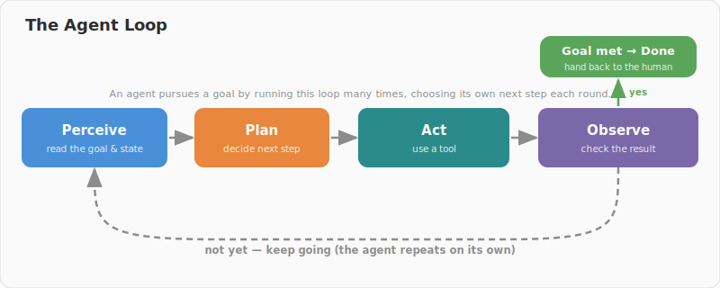
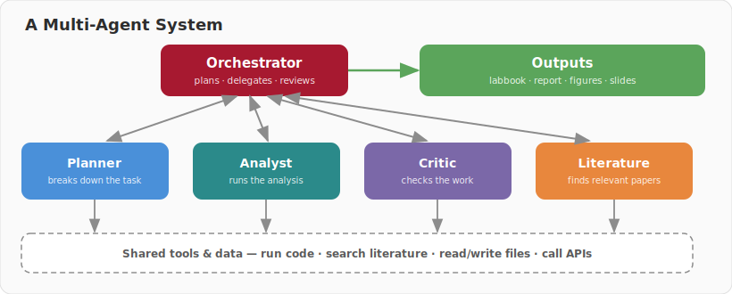

# Week 13: Agents, Ethics & Looking Back

> **The final session.** Two hours in two halves: a one-hour lecture (a quick look back, then AI agents and the ethics of modern AI), and a one-hour open discussion about how the course went — plus the post-class survey.

---

## Overview

You started this course having (for the most part) never written a line of code. You finish it able to explore data, fit and compare models, judge results honestly, and direct an AI collaborator rather than trust it blindly. This week we do three things: look back at that journey, look forward to where AI is heading (**agentic systems**), and look hard at the **ethics** of using modern AI in research, education, and society. Then the floor is yours.

## The two hours

| | |
|---|---|
| **Hour 1 — Lecture** | A short recap → how AI agents work and how they help research → the ethics of modern AI |
| **Hour 2 — Discussion** | An open conversation with the teaching team and guests about how the course went, then the post-class survey |

## Looking back

The thirteen-week arc, in one breath: foundations and the ML mindset (W1) → exploring data and predicting with regression (W2–4) → classification, trees, and forests (W5–6) → finding structure with clustering and dimensionality reduction (W7–8) → neural networks (W9–10) → meaning in vectors with embeddings and LLMs (W11) → defending your work in the viva (W12).

The tools will keep changing. What lasts is the **LLM Problem-Solving Loop** — plan, generate, and above all *verify* — and the two crafts of prompt engineering and context engineering.

## AI agents: from answering to acting

A chatbot answers in one turn. An **agent** is given a *goal* and the autonomy to pursue it over many turns: it plans, acts (by using tools), observes the result, and repeats until it's done. An agent is just **a language model + tools + a loop + memory**, pointed at a goal.

**Tools** are what let an agent *do* things rather than only talk — search the literature, run code, read and write files, call other software. **Memory** lets it work across many steps (a short-term context window, plus long-term notes or files it can re-read). And several agents can be combined, with an **orchestrator** delegating to specialists — including a *critic* that checks the work, much like a research team.

For behavioural research, agents can help with literature reviews, data-cleaning and analysis pipelines, model "sweeps", and first-draft figures and methods — always with a human checkpoint before anything is trusted.

### Open-source options to explore

- **[Urika](https://github.com/xkiwilabs/Urika)** — a multi-agent scientific analysis platform from our lab. It plans experiments, runs and evaluates methods, searches the literature, builds tools when it needs them, and writes up labbooks, reports, and slide decks automatically. It can even run on local, private models so sensitive data never leaves your machine.
- **GPT-Researcher** — autonomous web and literature research that returns a cited report.
- **OpenHands** — an autonomous coding agent that writes and runs code.
- **smolagents** (Hugging Face) — a lightweight framework for building your own simple agents.

**A reality check:** agents hallucinate, small errors compound across many steps, they cost real money and compute, and they can act on a misunderstanding faster than you can catch it. The more autonomy you grant, the *more* the Verify step matters — not less.

## The ethics of modern AI

Capability is not the same as permission. Three arenas:

- **Research integrity** — AI is a tool, not an author; *you* are accountable. Disclose how you used it (this course models that with a `Co-Authored-By` line on every commit), check every citation (AI invents references that look real), protect participant data, and record the model, version, and prompts so your method can be repeated.
- **Agentic p-hacking** — an agent can run thousands of analyses while you sleep. That is the garden of forking paths (Week 3) on fast-forward, so **pre-registration and held-out test sets matter more, not less**.
- **Education** — learning *with* AI versus offloading the thinking; academic integrity; and equity of access.
- **Society** — bias and fairness (Week 5), labour, the environment, misinformation, and the concentration of power.

A short **responsible-AI checklist**: disclose, verify, protect data, keep a human accountable, pre-register, and record versions. None of this is new ethics — it's good science applied honestly to a powerful new tool.

## The discussion (hour two)

An open, honest conversation. Some prompts to get us going:

- What **worked** for you this semester — and what **didn't**?
- What **surprised** you about learning to use AI for research?
- The **LLM-assisted format** — did it help your learning, or get in the way?
- Has your **confidence** with data and AI shifted? In which direction?
- What would you **change** for next year's cohort?

## Post-class survey

Please complete the short post-class survey — it's anonymous, takes about five minutes, and directly shapes future iterations of the course. *(Link provided in class.)*

## What you can claim

A closing thought that ties the whole course together: the point was never to make AI do your thinking. It was to make you a researcher who can use AI well — who knows what a result does and doesn't support, who can reproduce what they did, and who stays accountable for the conclusions. **Limits, ethics, reproducibility, and reasoned conclusions** — that's what lets you claim something honestly.

---

## Materials

- **Slides:** [`slides/index.html`](slides/index.html)
- **Readings:** [`readings.md`](readings.md)

---

*[Back to course overview](../../README.md)*
